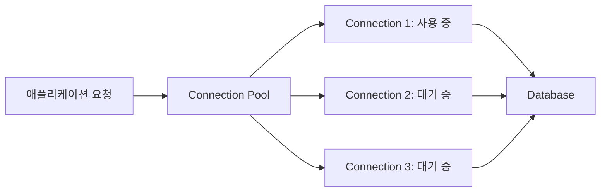

애플리케이션이 데이터베이스 연결을 미리 만들어 두고 재사용하는 구조를 뜻한다.

## 필요 여부

애플리케이션이 데이터베이스에 쿼리를 실행하려면 먼저 연결을 만들어야 한다.

```
애플리케이션
   ↓ TCP 연결
데이터베이스 인증
   ↓ 세션 생성
SQL 실행
   ↓
연결 종료
```

매 요청마다 이 과정을 반복하면 다음 비용이 발생한다.

- TCP 연결 수립
- TLS 핸드셰이크
- 사용자 인증
- 데이터베이스 세션 및 메모리 할당
- 연결 종료 처리

실제 SQL은 5ms 만에 끝나는데 연결을 만드는 데 30ms가 걸릴 수도 있다. Connection Pool은 이 연결을 한 번 만든 후 여러 요청에서 재사용해 이런 비용을 줄인다.

## 기본 동작 방식




처리 과정은 다음과 같다.

1. 애플리케이션이 Pool에 Connection을 요청한다.
2. 사용 가능한 Connection이 있으면 즉시 빌려준다.
3. 애플리케이션이 SQL과 트랜잭션을 수행한다.
4. `close()`를 호출한다.
5. 실제 연결을 종료하지 않고 Pool에 반환한다.
6. 이후 다른 요청이 같은 Connection을 재사용한다.

중요한 점은 Pool을 사용하는 환경에서 `connection.close()`는 일반적으로 물리적 연결 종료가 아니라 Pool 반환을 의미한다는 것이다.

```
try (Connection connection = dataSource.getConnection()) {
    // SQL 실행
}
// close()가 자동으로 호출되어 Pool로 반환됨
```

## Pool이 가질 수 있는 Connection 상태

Connection은 대체로 다음 상태 중 하나에 있다.

- Idle: Pool에서 사용되지 않고 대기 중
- Active: 애플리케이션이 빌려서 사용 중
- Waiting: Connection이 부족해 요청이 기다리는 상태
- Invalid: 네트워크나 DB 문제로 더 이상 사용할 수 없는 연결
- Evicted: 수명이나 유휴시간 제한을 넘어 제거되는 연결

예를 들어 Pool 최대 크기가 10이고 동시에 15개의 요청이 들어오면:

```
10개 요청 → Connection을 받아 처리
 5개 요청 → 반환될 때까지 대기
```

대기시간이 설정된 timeout을 넘으면 “Connection을 얻을 수 없다”는 예외가 발생한다.

## 주요 설정

Connection Pool 라이브러리마다 이름은 다르지만 개념은 거의 같다.

### maximumPoolSize

Pool이 가질 수 있는 최대 Connection 수이다.

```
maximumPoolSize: 20
```

20개가 모두 사용 중이면 이후 요청은 Connection이 반환될 때까지 기다린다.

크기를 무작정 키우면 안 된다. Connection이 많아지면 데이터베이스에서 다음 비용이 증가하기 때문이다.

- 세션별 메모리
- 동시 쿼리 실행
- CPU 컨텍스트 전환
- Lock 경합
- 디스크 및 네트워크 부하

애플리케이션에서는 빠른 것처럼 보여도 DB 전체 처리량이 오히려 감소할 수 있다.

### minimumIdle

사용하지 않더라도 유지할 최소 유휴 Connection 수이다.

```
minimumIdle: 5
```

트래픽이 갑자기 증가할 때 새 연결을 만드는 시간을 줄여준다. 다만 여러 서버가 각각 많은 idle connection을 유지하면 DB 연결 수를 낭비할 수 있다.

### connectionTimeout

Connection을 얻기 위해 기다릴 수 있는 최대 시간이다.

```
connectionTimeout: 3000
```

3초 안에 Connection을 얻지 못하면 예외를 발생시킨다. 이 값이 너무 크면 요청이 오랫동안 매달리고, 너무 작으면 순간적인 부하에도 오류가 발생할 수 있다.

### idleTimeout

사용하지 않는 Connection을 얼마 동안 유지할지 결정한다.

```
idleTimeout: 600000
```

최소 유휴 수보다 많은 Connection이 장시간 사용되지 않으면 정리한다.

### maxLifetime

하나의 물리적 Connection을 유지할 최대 수명이다.

```
maxLifetime: 1800000
```

DB, 프록시, 방화벽 또는 로드밸런서가 먼저 연결을 끊기 전에 Pool이 안전하게 교체하도록 설정한다.

예를 들어 네트워크 장비가 연결을 30분 후 끊는다면 Pool의 `maxLifetime`은 30분보다 조금 짧게 설정하는 것이 일반적이다.

### validationTimeout / Connection test

빌려주기 전에 연결이 살아 있는지 검사할 때 사용하는 제한 시간이다. 오래된 Connection이나 네트워크 단절 때문에 첫 쿼리부터 실패하는 문제를 줄여준다.

### keepaliveTime

장시간 사용하지 않은 Connection이 네트워크 장비에 의해 끊어지지 않도록 가벼운 유효성 검사를 주기적으로 수행한다.

## 적절한 Pool 크기

가장 중요한 원칙은 “요청 수만큼 Connection을 만들지 않는다”이다.

Pool 크기를 결정할 때 고려할 항목은 다음과 같다.

- 데이터베이스의 최대 연결 수
- 애플리케이션 인스턴스 수
- 쿼리 평균 및 상위 지연시간
- 한 요청이 Connection을 점유하는 시간
- DB의 CPU 및 I/O 처리 능력
- 운영, 배치, 모니터링 도구가 사용하는 연결
- 장애 시 재연결에 필요한 여유

예를 들어:

```
DB 최대 연결 수                  200
운영 및 관리용 예약               20
애플리케이션이 사용할 수 있는 수   180
애플리케이션 인스턴스                6
```

단순 분배하면 인스턴스당 최대 30개이지만, 배포 중 인스턴스가 일시적으로 2배가 될 수 있다면:

```
180 ÷ 12 = 인스턴스당 15개
```

처럼 배포 상황까지 고려해야 합니다.

실무에서는 작은 값으로 시작한 후 다음 지표를 보면서 조정하는 편이 안전하다.

- Connection 대기시간
- Active/Idle Connection 수
- Connection 획득 timeout 수
- DB CPU 사용률
- 쿼리 지연시간
- 트랜잭션 지속시간
- DB의 현재 연결 수

Pool이 계속 최대치에 도달한다고 해서 반드시 Pool이 작은 것은 아니다. 느린 쿼리나 긴 트랜잭션 때문에 Connection이 반환되지 않는 것일 수도 있다.

## Connection Leak

Connection을 빌린 뒤 반환하지 않는 문제이다.

```
Connection connection = dataSource.getConnection();
executeQuery(connection);

// 예외가 발생하면 close()가 호출되지 않을 수 있음
connection.close();
```

Leak이 반복되면 Pool의 모든 Connection이 사라진 것처럼 보이고, 신규 요청은 계속 대기하다 timeout 된다.

다음처럼 자동 반환 구조를 사용해야 한다.

```
try (Connection connection = dataSource.getConnection();
     PreparedStatement statement =
         connection.prepareStatement("SELECT * FROM users WHERE id = ?")) {

    statement.setLong(1, userId);

    try (ResultSet resultSet = statement.executeQuery()) {
        // 결과 처리
    }
}
```

Spring/JPA 같은 프레임워크에서는 트랜잭션 관리자가 반환을 처리하지만, 트랜잭션 범위를 과도하게 길게 잡지 않아야 한다.

## 트랜잭션과 Connection

트랜잭션이 시작되면 일반적으로 하나의 Connection을 트랜잭션이 끝날 때까지 점유한다.

```
Connection 획득
→ BEGIN
→ 데이터 조회
→ 외부 API 호출 5초 대기
→ 데이터 수정
→ COMMIT
→ Connection 반환
```

위 구조에서는 실제 DB 작업이 짧아도 외부 API 호출 동안 Connection을 계속 점유할 수 있다. 외부 통신은 가능하면 DB 트랜잭션 밖에서 수행하는 것이 좋다.

또한 Connection을 반환하기 전에 다음 상태가 초기화되어야 한다.

- `autoCommit`
- 읽기 전용 여부
- 트랜잭션 격리 수준
- 미완료 트랜잭션
- 세션 변수
- 임시 테이블이나 DB별 세션 상태

Pool이나 프레임워크가 일부를 초기화하지만, 애플리케이션이 특수한 세션 상태를 변경했다면 직접 복원해야 할 수 있다.

## 대표적인 장애 패턴

### Pool exhaustion

모든 Connection이 사용 중이라 새로운 요청이 Connection을 얻지 못한다.

주요 원인은 다음과 같다.

- Connection leak
- 느린 쿼리
- Lock 대기
- 긴 트랜잭션
- 외부 API 호출을 포함한 트랜잭션
- DB 성능 저하
- Pool 크기가 실제 트래픽에 비해 너무 작음

### Pool을 너무 크게 설정

애플리케이션 서버마다 Pool을 100개로 설정하고 서버가 20대라면 최대 2,000개의 연결을 시도할 수 있다. DB 최대 연결 수가 500이면 일부 서버는 시작이나 장애 복구 과정에서 연결을 만들지 못한다.

### 오래되어 끊어진 Connection

방화벽 또는 DB가 idle connection을 끊었는데 Pool이 이를 알지 못한 경우이다. `maxLifetime`, keepalive, validation 관련 설정을 점검해야 한다.

### 재연결 폭주

DB가 재시작된 후 모든 애플리케이션 인스턴스가 동시에 Connection을 다시 생성하면 DB에 순간적인 부하가 집중된다. 재시도 간격에 지수 백오프와 무작위 지연을 적용하는 것이 도움이 된다.

## Java HikariCP 예시

Spring Boot에서 흔히 사용하는 설정이다.

```
spring:
  datasource:
    url: jdbc:postgresql://db.example.com:5432/app
    username: app_user
    password: ${DB_PASSWORD}
    hikari:
      maximum-pool-size: 15
      minimum-idle: 5
      connection-timeout: 3000
      idle-timeout: 600000
      max-lifetime: 1700000
      keepalive-time: 300000
```

이 값들은 예시일 뿐이다. 특히 `maximum-pool-size`와 수명 관련 값은 DB 설정, 인스턴스 수, 프록시 및 네트워크 제한을 기준으로 결정해야 한다.