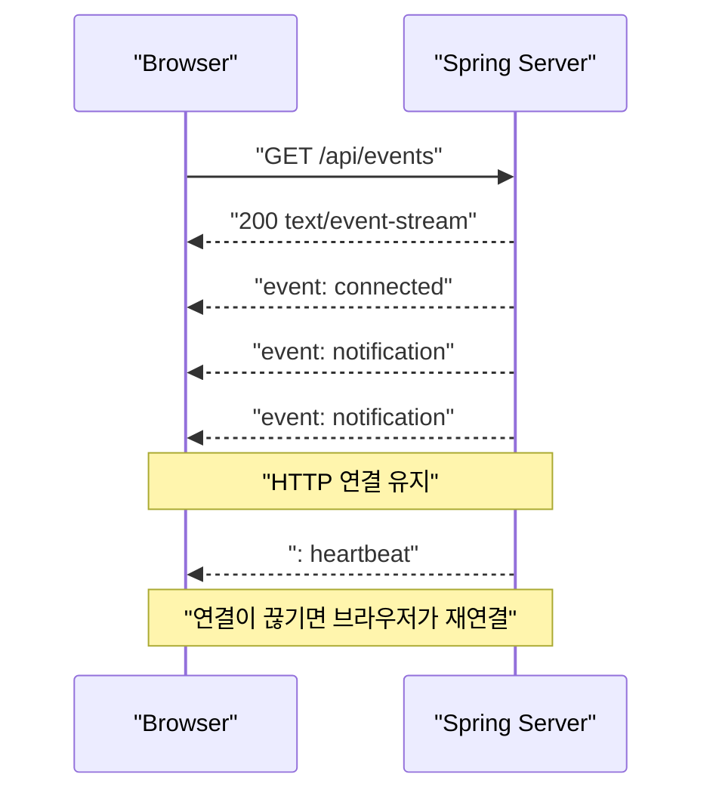

SSE는 웹 기술인 **Server-Sent Events**를 뜻한다.

SSE는 클라이언트가 HTTP 연결을 하나 열어 두면, 서버가 그 연결을 통해 이벤트를 계속 전달하는 기술이다.

> 클라이언트 → 서버 통신은 일반 HTTP 요청으로 처리, 서버 → 클라이언트의 실시간 알림만 스트리밍

실시간 알림, 작업 진행률, 로그 스트리밍, 주가·센서 데이터, AI 응답 스트리밍 등에 잘 맞다.

---

## SSE의 기본 동작

클라이언트가 다음과 같이 요청한다.

```
GET /api/events HTTP/1.1
Accept: text/event-stream
```

서버는 응답을 종료하지 않고 `text/event-stream` 형식으로 데이터를 계속 보낸다.

```
HTTP/1.1 200 OK
Content-Type: text/event-stream
Cache-Control: no-cache
Connection: keep-alive

id: 101
event: notification
data: {"message":"새로운 주문이 들어왔습니다."}

id: 102
event: notification
data: {"message":"결제가 완료되었습니다."}
```

일반 HTTP 응답은 데이터를 다 보내면 연결을 닫지만, SSE 응답은 연결을 유지하면서 빈 줄로 구분된 이벤트를 계속 전송한다.

````

````

---

## SSE 이벤트 형식

하나의 이벤트는 여러 필드로 구성할 수 있다.

```
id: 123
event: order-created
retry: 3000
data: {"orderId":42,"amount":15000}
```

마지막의 빈 줄이 이벤트 하나의 끝이다.

### `data`

실제로 전달할 데이터이다.

```
data: hello
```

여러 줄로 작성할 수도 있다.

```
data: first line
data: second line
```

클라이언트에서는 줄바꿈이 결합된 하나의 `event.data`로 받는다.

### `event`

이벤트 종류를 지정한다.

```
event: order-created
data: {"orderId":42}
```

클라이언트는 해당 이름으로 이벤트를 구독한다.

```
eventSource.addEventListener("order-created", event => {
    const order = JSON.parse(event.data);
    console.log(order);
});
```

`event`가 없으면 기본 `message` 이벤트가 발생한다.

### `id`

이벤트 식별자이다.

```
id: 123
data: important event
```

브라우저는 마지막으로 정상 수신한 ID를 기억한다. 연결이 끊겼다가 다시 연결될 때 보통 다음 헤더를 보낸다.

```
Last-Event-ID: 123
```

서버는 이를 이용해 124번 이후 이벤트를 재전송할 수 있다.

단, `id`만 붙인다고 복구가 자동으로 완성되는 것은 아니다. 서버가 이벤트를 Redis Stream, Kafka, 데이터베이스 등의 저장소에 보관하고 있어야 누락 이벤트를 다시 읽을 수 있다.

### `retry`

재연결 대기 시간을 밀리초로 알려준다.

```
retry: 5000
```

연결이 끊기면 브라우저가 약 5초 후 다시 연결한다.

### 주석

콜론으로 시작하는 줄은 주석이다.

```
: heartbeat
```

클라이언트에는 이벤트로 전달되지 않지만 실제 네트워크 쓰기는 발생하므로 연결 상태 확인과 프록시 타임아웃 방지용 heartbeat로 사용할 수 있다.

---

## 브라우저의 `EventSource`

브라우저에는 SSE를 위한 `EventSource` API가 기본 제공된다.

```
const eventSource = new EventSource("/api/events");

eventSource.onopen = () => {
    console.log("SSE 연결 성공");
};

eventSource.onmessage = event => {
    console.log("기본 이벤트:", event.data);
};

eventSource.addEventListener("notification", event => {
    const notification = JSON.parse(event.data);
    console.log(notification.message);
});

eventSource.onerror = error => {
    console.error("SSE 연결 오류", error);
    // 일반적인 연결 오류라면 브라우저가 자동 재연결
};

// 더 이상 이벤트가 필요하지 않을 때
// eventSource.close();
```

SSE는 서버에서 브라우저로만 데이터를 보내는 **단방향 통신**이다. 클라이언트가 서버로 데이터를 보낼 때는 별도의 `fetch`, REST API 등을 사용해야 한다.

---

## Spring WebFlux에서 구현하기

동시 연결이 많고 전체 애플리케이션이 논블로킹 구조라면 WebFlux가 더 자연스럽다.

```
dependencies {
    implementation 'org.springframework.boot:spring-boot-starter-webflux'
}
```

```
import org.springframework.http.MediaType;
import org.springframework.http.codec.ServerSentEvent;
import org.springframework.web.bind.annotation.GetMapping;
import org.springframework.web.bind.annotation.RestController;
import reactor.core.publisher.Flux;

import java.time.Duration;
import java.time.Instant;

@RestController
public class TimeStreamController {

    @GetMapping(
            value = "/api/time-stream",
            produces = MediaType.TEXT_EVENT_STREAM_VALUE
    )
    public Flux<ServerSentEvent<TimeMessage>> stream() {
        return Flux.interval(Duration.ofSeconds(1))
                .onBackpressureDrop()
                .map(sequence ->
                        ServerSentEvent.<TimeMessage>builder()
                                .id(String.valueOf(sequence))
                                .event("time")
                                .retry(Duration.ofSeconds(3))
                                .data(new TimeMessage(
                                        sequence,
                                        Instant.now()
                                ))
                                .build()
                );
    }

    public record TimeMessage(
            long sequence,
            Instant time
    ) {
    }
}
```

클라이언트:

```
const source = new EventSource("/api/time-stream");

source.addEventListener("time", event => {
    const value = JSON.parse(event.data);
    console.log(value.sequence, value.time);
});
```

`ServerSentEvent<T>`는 `id`, `event`, `retry`, `comment`, `data`를 명시적으로 표현한다. 단순 데이터만 필요하면 다음처럼 `Flux<T>`를 반환하는 것도 가능하다.

```
@GetMapping(
        value = "/api/numbers",
        produces = MediaType.TEXT_EVENT_STREAM_VALUE
)
public Flux<Long> numbers() {
    return Flux.interval(Duration.ofSeconds(1));
}
```

Spring에서는 `Flux<ServerSentEvent<T>>`를 MVC의 `SseEmitter`에 대응하는 리액티브 방식으로 설명한다.

### MVC와 WebFlux

- 기존 애플리케이션이 `spring-boot-starter-web`, JPA, JDBC 중심이면 `SseEmitter`가 자연스럽다.
- 애플리케이션 전체가 WebFlux, R2DBC, Reactive Redis 등 논블로킹 구조라면 `Flux<ServerSentEvent<?>>`가 자연스럽다.
- SSE 하나만을 위해 JPA 기반 MVC 애플리케이션 전체를 WebFlux로 바꿀 필요는 없다.
- WebFlux 컨트롤러 안에서 JDBC나 일반 JPA 같은 블로킹 작업을 그대로 호출하면 WebFlux의 장점이 크게 줄어든다.

---

## 자동 재연결과 이벤트 복구 차이

SSE에서 자주 혼동되는 부분이다.

### 자동 재연결

브라우저가 연결을 다시 여는 기능이다. `EventSource`가 기본으로 지원한다.

### 이벤트 복구

연결이 끊긴 동안 발생한 이벤트를 서버가 다시 보내는 기능이다. 서버에서 별도로 구현해야 한다.

예를 들어 마지막 수신 ID가 150이라면:

```
GET /api/events
Last-Event-ID: 150
```

서버는 저장소에서 151 이후 이벤트를 조회해야 한다.

```
@GetMapping(
        value = "/events",
        produces = MediaType.TEXT_EVENT_STREAM_VALUE
)
public SseEmitter subscribe(
        @RequestHeader(
                value = "Last-Event-ID",
                required = false
        ) String lastEventId
) {
    SseEmitter emitter = sseService.connect();

    if (lastEventId != null) {
        eventRepository.findAfter(lastEventId)
                .forEach(event -> sseService.sendTo(emitter, event));
    }

    return emitter;
}
```

실무 구조는 대략 다음과 같다.

```
업무 이벤트
    ↓
Kafka / Redis Stream / DB
    ↓
SSE 서버
    ↓
브라우저
```

중요한 이벤트라면 메모리의 `ConcurrentHashMap`만 사용해서는 안 된다. 서버 재시작, 다중 인스턴스, 네트워크 단절 시 이벤트가 유실될 수 있기 때문이다.

---

## SSE와 WebSocket 비교

|항목|SSE|WebSocket|
|---|---|---|
|통신 방향|서버 → 클라이언트|양방향|
|기반 프로토콜|일반 HTTP|HTTP 업그레이드 후 WebSocket|
|브라우저 API|`EventSource`|`WebSocket`|
|자동 재연결|기본 지원|직접 구현|
|이벤트 ID/복구 힌트|`id`, `Last-Event-ID`|직접 설계|
|데이터 형식|UTF-8 텍스트|텍스트 또는 바이너리|
|프록시·인프라 호환성|비교적 쉬움|별도 설정이 필요한 경우가 많음|
|적합한 사례|알림, 진행률, 피드, 로그|채팅, 게임, 협업 편집, 양방향 제어|

다음과 같은 경우 SSE가 적절하다.

- 주문 상태나 배달 상태 알림
- 서버 작업 진행률
- 실시간 대시보드
- 로그 스트리밍
- 생성형 AI 토큰 스트리밍
- 서버 상태 또는 모니터링 데이터

클라이언트가 짧은 간격으로 서버에 계속 데이터를 보내야 한다면 WebSocket이 더 적절할 가능성이 크다.

---

## Polling과의 차이

Polling은 클라이언트가 반복 요청한다.

```
GET /status
GET /status
GET /status
GET /status
```

변경 사항이 없어도 요청과 응답이 반복된다.

SSE는 연결을 한 번 열고 변경이 있을 때만 서버가 전송한다.

```
GET /events
    ← event
    ← event
    ← event
```

Long Polling은 서버가 이벤트가 생길 때까지 응답을 보류하지만, 이벤트 하나를 받으면 보통 다시 요청해야 한다. SSE는 동일 연결에서 여러 이벤트를 연속으로 받는다.

---

## 주의할 점

### 프록시 버퍼링

Nginx, CDN, 로드밸런서가 응답을 모아 두었다가 한꺼번에 전달하면 실시간성이 사라진다.

Nginx를 사용하는 경우 대표적으로 다음 설정을 검토한다.

```
location /api/events {
    proxy_pass http://spring-app;
    proxy_http_version 1.1;
    proxy_buffering off;
    proxy_read_timeout 1h;
}
```

애플리케이션에서 다음 헤더를 추가하는 경우도 있다.

```
return ResponseEntity.ok()
        .header("Cache-Control", "no-cache")
        .header("X-Accel-Buffering", "no")
        .contentType(MediaType.TEXT_EVENT_STREAM)
        .body(emitter);
```

단, 실제 설정은 사용하는 Nginx·CDN·로드밸런서에 맞춰야 한다.

### Heartbeat

중간 장비는 일정 시간 데이터가 흐르지 않으면 유휴 연결을 끊을 수 있다. 일반적으로 15~30초 정도 간격으로 주석 heartbeat를 보낸다.

```
: heartbeat
```

### 연결 정리

완료, 타임아웃, 오류 시 구독자를 반드시 제거해야 한다.

```
emitter.onCompletion(() -> remove(emitter));
emitter.onTimeout(() -> remove(emitter));
emitter.onError(error -> remove(emitter));
```

그렇지 않으면 끊어진 연결이 메모리에 계속 남는다.

### 인증

브라우저의 기본 `EventSource`는 임의의 `Authorization` 헤더를 지정하는 인터페이스를 제공하지 않는다.

따라서 보통 다음 중 하나를 사용한다.

- 같은 출처의 세션 쿠키
- HttpOnly 인증 쿠키
- 헤더 설정을 지원하는 EventSource polyfill
- `fetch()`의 스트리밍 응답 처리

URL 쿼리 파라미터에 장기 JWT를 넣는 방식은 서버 로그, 브라우저 기록, 모니터링 시스템에 토큰이 노출될 수 있어 가급적 피해야 한다.

교차 출처 쿠키가 필요하면:

```
const source = new EventSource(
    "https://api.example.com/events",
    { withCredentials: true }
);
```

서버에도 정확한 CORS 및 credential 설정이 필요하다.

### 다중 서버 인스턴스

각 서버가 자기 메모리에만 `SseEmitter`를 보관하면 이벤트를 발생시킨 서버와 사용자가 연결된 서버가 다를 수 있다.

```
사용자 ── 연결 ── 서버 A
주문 이벤트 ──── 서버 B
```

해결 방법은 보통 다음과 같다.

- Redis Pub/Sub 또는 Redis Streams
- Kafka
- RabbitMQ
- DB 기반 이벤트 테이블
- 제한적인 상황에서 sticky session

중요한 이벤트에는 단순 Pub/Sub보다 재처리가 가능한 Redis Streams나 Kafka 같은 구조가 더 적합하다.

### 느린 클라이언트

서버가 만드는 이벤트 속도보다 클라이언트가 소비하는 속도가 느리면 버퍼가 증가할 수 있다.

대책은 다음과 같다.

- 오래된 상태 이벤트 버리기
- 최신 상태만 유지하기
- 버퍼 크기 제한
- 너무 느린 연결 종료
- 이벤트 묶어서 전송하기
- 구독자가 필요로 하는 이벤트만 필터링하기

WebFlux의 backpressure가 애플리케이션 내부 흐름 제어에는 도움을 주지만, SSE 프로토콜 자체에는 클라이언트의 이벤트별 ACK가 없다.

### HTTP/1.1 연결 제한

HTTP/1.1에서는 브라우저가 동일 출처에 열 수 있는 연결 수가 제한되므로 여러 탭에서 SSE를 많이 열면 문제가 생길 수 있다. MDN은 HTTP/1.1 환경의 브라우저별 낮은 연결 제한과 HTTP/2의 다중 스트림 차이를 설명하고 있다. 가능하면 HTTP/2 사용과 페이지당 SSE 연결 통합을 고려하는 것이 좋다.