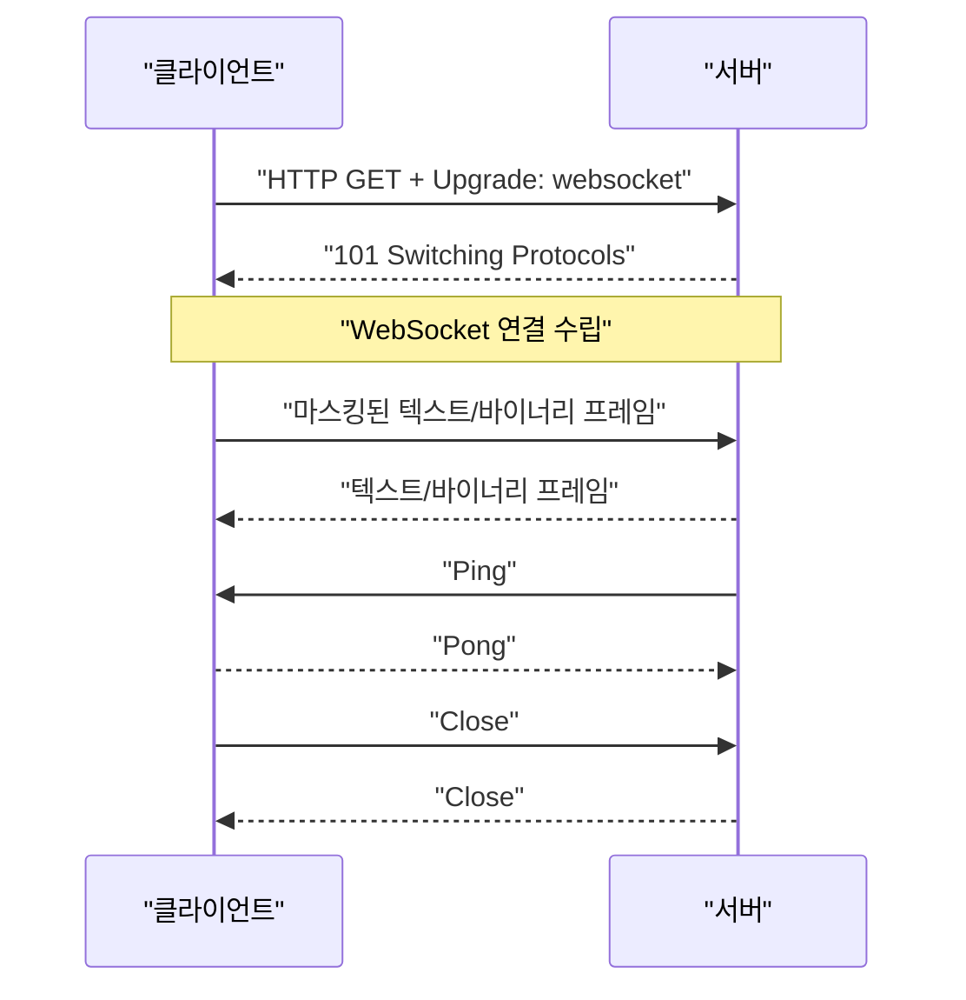
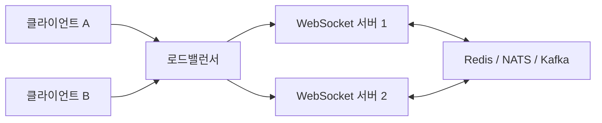

## WebSocket

WebSocket은 클라이언트와 서버가 **하나의 연결을 오래 유지하면서 양쪽이 언제든 메시지를 보낼 수 있게 하는 전이중(full-duplex) 통신 프로토콜*이다.

일반 HTTP에서는 보통 클라이언트가 요청해야 서버가 응답한다.

```
클라이언트 ── 요청 ──▶ 서버
클라이언트 ◀─ 응답 ─── 서버
```

WebSocket 연결이 수립된 뒤에는 요청과 응답의 구분 없이 양쪽이 독립적으로 메시지를 보낼 수 있다.

```
클라이언트 ◀══════════▶ 서버
        지속되는 양방향 연결
```

채팅, 실시간 게임, 공동 편집, 거래 시세, 실시간 알림처럼 **서버가 즉시 데이터를 밀어줘야 하고 클라이언트도 자주 데이터를 보내는 경우**에 적합하다.

---

## WebSocket 특징

### 지속 연결

HTTP 요청마다 새 연결을 만드는 대신 한 번 연결한 뒤 계속 사용한다. HTTP keep-alive 역시 TCP 연결을 재사용하지만, 통신 모델은 여전히 요청과 응답 중심이다. WebSocket은 연결 수립 후 서버가 요청 없이 메시지를 보낼 수 있다.

### 전이중 통신

클라이언트와 서버가 동시에 메시지를 전송할 수 있다. “클라이언트 요청 → 서버 응답” 순서를 지킬 필요가 없다.

### 메시지 단위 통신

TCP는 단순한 바이트 스트림이지만 WebSocket은 다음과 같은 메시지 경계를 제공한다.

- 텍스트 메시지: UTF-8
- 바이너리 메시지: 이미지, 오디오, Protobuf 등 임의 데이터
- 제어 메시지: 연결 종료, Ping, Pong

### 낮은 메시지 오버헤드

연결 이후에는 매번 긴 HTTP 헤더를 보내지 않고 작은 WebSocket 프레임 헤더를 사용한다. 페이로드가 125바이트 이하라면 기본 헤더는 서버 프레임 기준 최소 2바이트, 클라이언트 프레임 기준 마스킹 키를 포함해 최소 6바이트이다.

---

## 연결 방법

WebSocket은 HTTP와 완전히 별개의 연결로 시작하지 않는다. HTTP/1.1에서는 먼저 HTTP 요청을 보내고, 서버와 합의한 뒤 WebSocket 프로토콜로 전환한다.





### 클라이언트의 HTTP/1.1 요청

```
GET /chat HTTP/1.1
Host: example.com
Upgrade: websocket
Connection: Upgrade
Sec-WebSocket-Key: dGhlIHNhbXBsZSBub25jZQ==
Sec-WebSocket-Version: 13
Origin: https://example.com
Sec-WebSocket-Protocol: chat.v2
```

주요 헤더는 다음과 같습니다.

- `Upgrade: websocket`: WebSocket으로 전환하고 싶다는 의미
- `Connection: Upgrade`: 현재 연결을 업그레이드한다는 의미
- `Sec-WebSocket-Key`: 클라이언트가 생성한 임의의 값
- `Sec-WebSocket-Version: 13`: 현재 표준 버전
- `Origin`: 브라우저에서 연결을 시작한 웹 페이지의 출처
- `Sec-WebSocket-Protocol`: 사용할 애플리케이션 하위 프로토콜 후보

### 서버 응답

```
HTTP/1.1 101 Switching Protocols
Upgrade: websocket
Connection: Upgrade
Sec-WebSocket-Accept: s3pPLMBiTxaQ9kYGzzhZRbK+xOo=
Sec-WebSocket-Protocol: chat.v2
```

서버는 다음 계산으로 `Sec-WebSocket-Accept`를 생성한다.

```
Base64(
  SHA-1(
    Sec-WebSocket-Key
    + "258EAFA5-E914-47DA-95CA-C5AB0DC85B11"
  )
)
```

이 값은 상대 서버가 WebSocket 핸드셰이크를 이해했다는 것을 확인하기 위한 것이며, **암호화나 사용자 인증 기능은 아니다**.

### HTTP/2와 HTTP/3

HTTP/2에는 연결 전체를 전환하는 `Upgrade` 방식이 맞지 않으므로 Extended CONNECT를 이용해 WebSocket을 HTTP/2 스트림에 실을 수 있다.

HTTP/3에서도 같은 개념을 사용할 수 있다. 다만 연결을 만든 뒤 주고받는 데이터 자체는 여전히 WebSocket 프레임이다.

---

## `ws://`와 `wss://`

WebSocket에는 두 가지 URL 스킴이 있다.

- `ws://example.com/chat`: 암호화하지 않은 WebSocket
- `wss://example.com/chat`: TLS로 보호되는 WebSocket

`wss`는 HTTPS에 대응하는 형태이다. 운영 환경에서는 거의 항상 `wss://`를 사용해야 한다.

TLS가 제공하는 것은 다음과 같다.

- 전송 데이터 암호화
- 데이터 변조 방지
- 서버 인증
- 선택적인 클라이언트 인증

WebSocket의 마스킹은 암호화가 아니므로 `ws://`를 안전하게 만들어주지 않는다.

---

## 데이터는 프레임으로 전달

하나의 WebSocket 메시지는 하나 이상의 프레임으로 구성된다.

```
┌─────┬────────┬────────┬──────┬────────────┬──────────────┐
│ FIN │ RSV1-3 │ Opcode │ MASK │ Payload Len│ Masking Key  │
└─────┴────────┴────────┴──────┴────────────┴──────────────┘
                                               + Payload
```

주요 필드는 다음과 같다.

### `FIN`

현재 프레임이 메시지의 마지막 프레임인지 나타낸다.

큰 메시지는 다음처럼 여러 프레임으로 나눌 수 있다.

```
Text frame, FIN=0
Continuation frame, FIN=0
Continuation frame, FIN=1
```

이를 프래그먼테이션이라고 한다.

### `Opcode`

프레임의 종류이다.

|Opcode|의미|
|---|---|
|`0x0`|이전 메시지의 연속 프레임|
|`0x1`|UTF-8 텍스트|
|`0x2`|바이너리|
|`0x8`|Close|
|`0x9`|Ping|
|`0xA`|Pong|

### `MASK`

브라우저를 포함한 클라이언트가 서버로 보내는 프레임은 반드시 마스킹해야 한다. 4바이트 마스킹 키와 XOR 연산을 사용한다.

서버가 클라이언트로 보내는 프레임은 마스킹하지 않는다. 마스킹은 중간 장비가 WebSocket 데이터를 다른 프로토콜의 요청으로 오인하는 문제를 줄이기 위한 장치이며, 보안 암호화가 아니다.

### Payload length

작은 메시지는 기본 헤더에 길이를 바로 기록한다. 더 큰 메시지는 추가로 16비트 또는 64비트 길이 필드를 사용한다. 프로토콜상 매우 큰 메시지가 가능해도 서버는 메모리 고갈 공격을 막기 위해 현실적인 최대 크기를 제한해야 한다.

---

## WebSocket이 보장하는 것과 보장하지 않는 것

WebSocket은 일반적으로 TCP의 특성을 이어받는다.

### 보장하는 것

- 같은 연결 안에서 메시지가 전송 순서대로 도착
- 전송 중 손상된 TCP 데이터의 재전송
- 텍스트와 바이너리 메시지 경계
- 정상적인 연결 종료 절차
- Ping/Pong 제어 프레임

### 보장하지 않는 것

- 자동 재연결
- 연결이 끊긴 동안의 메시지 저장
- 메시지 처리 완료 확인
- 중복 메시지 제거
- Exactly-once 전달
- 사용자 인증과 권한 검사
- 채널, 방, 토픽, 브로드캐스트
- 연결 복구 후 놓친 메시지 재생

예를 들어 클라이언트가 메시지를 보낸 직후 연결이 끊기면 다음 두 경우를 구분하기 어렵다.

```
1. 서버에 도착하기 전에 연결이 끊김
2. 서버가 처리했지만 ACK가 돌아오기 전에 연결이 끊김
```

따라서 중요한 작업에는 애플리케이션 계층의 메시지 ID와 ACK가 필요한다.

```
{
  "type": "payment.request",
  "messageId": "01JXYZ...",
  "payload": {
    "orderId": "ORD-123"
  }
}
```

서버는 `messageId`를 이용해 중복 요청을 멱등하게 처리해야 한다.

---

## 애플리케이션 메시지 설계

WebSocket은 전송 방법만 정의한다. 실제 메시지 형식은 애플리케이션이 결정한다.

단순한 JSON 프로토콜은 다음과 같이 설계할 수 있다.

```
{
  "version": 1,
  "type": "chat.message.send",
  "requestId": "req-123",
  "roomId": "room-7",
  "payload": {
    "text": "안녕하세요"
  }
}
```

서버 응답:

```
{
  "version": 1,
  "type": "chat.message.ack",
  "requestId": "req-123",
  "messageId": "msg-987",
  "sequence": 152
}
```

보통 명시하는 것들:

- `type`: 메시지 종류
- `version`: 프로토콜 또는 스키마 버전
- `requestId`: 요청과 결과의 연결
- `messageId`: 중복 제거
- `sequence`: 재연결 후 누락 탐지
- `timestamp`: 관측 및 정렬 보조
- `payload`: 실제 데이터
- `error`: 구조화된 오류 정보

텍스트 기반 JSON은 디버깅하기 쉽지만 크기가 크다. 트래픽이 많다면 Protobuf, MessagePack 같은 바이너리 인코딩을 고려할 수 있다.

---

## 연결 유지와 장애 감지

TCP 연결이 존재한다고 해서 상대 애플리케이션이 정상이라고 단정할 수는 없다. 모바일 네트워크, NAT, 로드밸런서, 프록시가 조용히 연결을 제거할 수 있다.

### Ping/Pong

서버는 주기적으로 Ping을 보내고 일정 시간 안에 Pong이 오지 않으면 연결을 끊을 수 있다.

브라우저 WebSocket API에는 직접 Ping 프레임을 보내는 메서드가 없다. 서버가 프로토콜 Ping을 보내면 브라우저가 Pong을 처리하도록 하거나, 다음과 같은 애플리케이션 메시지를 사용할 수 있다.

```
{ "type": "heartbeat", "timestamp": 1785360000000 }
```

### 재연결

브라우저 WebSocket에는 자동 재연결 기능이 없다. 클라이언트가 직접 구현해야 한다.

권장 방식은 지수 백오프와 지터이다.

```
1초 → 2초 → 4초 → 8초 → 최대 30초
각 시간에 임의의 지터 추가
```

지터가 없으면 서버 재시작 후 수십만 클라이언트가 동시에 재접속하는 “재연결 폭풍”이 발생할 수 있다.

재연결 후에는 마지막으로 처리한 `sequence`나 이벤트 ID를 서버에 전달해 누락분을 요청하는 방식이 좋다.

---

## 연결 종료

정상 종료에서는 한쪽이 Close 프레임을 보내고 상대가 Close로 응답한 뒤 TCP 연결을 닫는다.

대표적인 종료 코드는 다음과 같다.

|코드|의미|
|---|---|
|`1000`|정상 종료|
|`1001`|서버 종료 또는 페이지 이동|
|`1002`|프로토콜 오류|
|`1003`|지원하지 않는 데이터 형식|
|`1007`|잘못된 UTF-8 등 데이터 오류|
|`1008`|정책 위반|
|`1009`|메시지가 너무 큼|
|`1011`|서버 내부 오류|

`1006`은 비정상 종료를 표현하는 로컬 상태값으로, Close 프레임에 실어서 보내는 코드는 아니다.

---

## 서버 확장 구조

WebSocket 서버를 여러 대로 확장하면 단순 HTTP 서버보다 고려할 사항이 많다.



사용자 A는 서버 1에, 사용자 B는 서버 2에 연결될 수 있다. 서버 1이 B에게 메시지를 보내려면 노드 간 이벤트 전달 시스템이 필요하다.

주요 운영 요소는 다음과 같다.

- 로드밸런서의 WebSocket 지원
- 프록시와 로드밸런서의 idle timeout
- 사용자와 연결 ID의 매핑
- 노드 간 Pub/Sub
- 서버 배포 시 연결 드레이닝
- 파일 디스크립터와 메모리 제한
- 느린 클라이언트의 송신 큐 제한
- 재접속 폭풍 방지
- 연결별 인증 상태 관리

Sticky session을 사용할 수도 있지만, 서버 상태를 외부 저장소나 메시지 브로커로 분리하면 특정 노드 의존성을 줄일 수 있다.

---

## 백프레셔

서버가 클라이언트가 소비하는 속도보다 빠르게 메시지를 보내면 메모리 큐가 계속 증가할 수 있다.

브라우저에서는 `bufferedAmount`를 통해 아직 네트워크로 전송되지 않은 데이터 크기를 확인할 수 있다.

```
const socket = new WebSocket("wss://example.com/realtime");

function sendSafely(message) {
  if (socket.readyState !== WebSocket.OPEN) return false;

  if (socket.bufferedAmount > 1_000_000) {
    return false;
  }

  socket.send(JSON.stringify(message));
  return true;
}
```

운영 시스템은 무한 큐 대신 다음 중 하나를 선택해야 한다.

- 오래된 상태 업데이트 버리기
- 최신 값으로 병합하기
- 전송 속도 제한
- 낮은 우선순위 메시지 버리기
- 지나치게 느린 연결 종료하기

실시간 주가나 마우스 위치처럼 “최신 상태”가 중요한 데이터는 중간 값을 전부 보내기보다 최신 값으로 합치는 것이 효과적이다.

---

## 압축

WebSocket은 `permessage-deflate` 확장을 통해 메시지 단위 압축을 협상할 수 있다.

```
Sec-WebSocket-Extensions: permessage-deflate
```

압축은 큰 텍스트 메시지의 대역폭을 줄이지만 다음 비용이 있다.

- 압축과 해제에 CPU 사용
- 연결별 압축 컨텍스트로 인한 메모리 증가
- 작은 메시지는 오히려 비효율적일 수 있음
- 압축 폭탄과 과도한 압축 해제 방어 필요
- 비밀 정보와 공격자 입력을 함께 압축할 때 부채널 위험

동시 연결이 많다면 압축률만 볼 것이 아니라 연결당 메모리와 CPU도 측정해야 한다.

---

## 보안에서 중요한 부분

### `wss://` 사용

운영 환경에서는 TLS를 기본으로 사용해야 한다.

### `Origin` 검증

일반적인 CORS 요청과 달리 WebSocket은 브라우저가 보내는 `Origin`을 서버가 직접 검증해야 한다. 특히 쿠키 인증을 사용하면서 이를 검사하지 않으면 악성 사이트가 사용자의 브라우저를 통해 WebSocket 연결을 만들 수 있다.

### 인증과 권한 검사를 구분

연결 시 사용자를 인증했다고 모든 메시지를 허용해서는 안 된다.

```
연결 인증: 이 사용자가 누구인가?
메시지 권한: 이 사용자가 이 방을 구독하거나 이 작업을 실행할 수 있는가?
```

방 구독, 문서 수정, 관리자 작업 등에 대해 메시지마다 권한을 검사해야 한다.

### 입력 제한

- 메시지 최대 크기 제한
- JSON 스키마 검증
- 메시지 전송 빈도 제한
- 동시 구독 수 제한
- 알 수 없는 메시지 타입 거부
- 인증 전 허용하는 메시지 제한
- 민감한 토큰을 URL 쿼리에 넣지 않기

브라우저의 `new WebSocket()` API는 임의의 HTTP 헤더를 자유롭게 추가할 수 없다는 점도 인증 설계에 영향을 준다.

---

## WebSocket과 Socket.IO 차이

WebSocket은 표준 프로토콜이다. Socket.IO는 WebSocket 등을 이용해 더 높은 수준의 기능을 제공하는 별도의 라이브러리 및 애플리케이션 프로토콜이다.

Socket.IO는 일반적으로 다음 기능을 추가한다.

- 자동 재연결
- 이벤트 이름
- ACK
- 방과 네임스페이스
- 브로드캐스트
- 연결 폴백

따라서 일반 WebSocket 클라이언트가 Socket.IO 서버에 그대로 접속할 수 있는 것은 아니다.