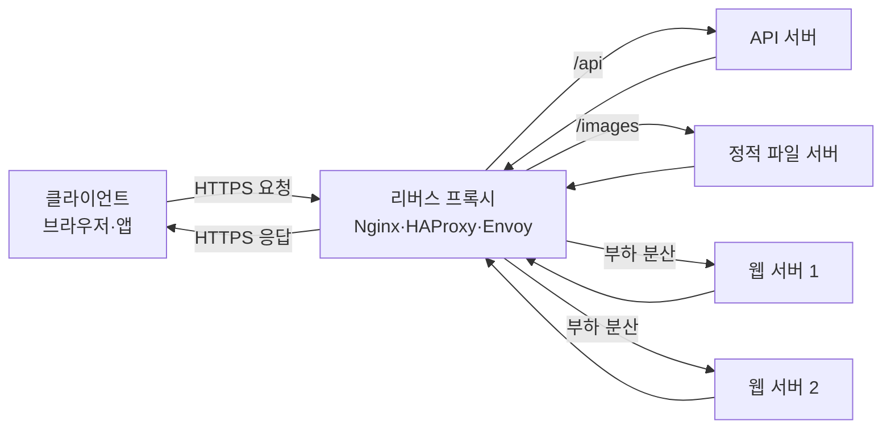

## 리버스 프록시란

리버스 프록시(reverse proxy)는 **클라이언트의 요청을 대신 받아 내부 서버로 전달하고, 내부 서버의 응답을 다시 클라이언트에게 돌려주는 서버**이다.

클라이언트 입장에서는 리버스 프록시가 실제 서비스 서버처럼 보인다. 뒤에 웹 서버가 한 대 있는지, 수십 대 있는지, 서로 다른 서비스가 연결되어 있는지는 알 필요가 없다.

````

````

예를 들어 사용자가 다음 주소로 요청한다고 가정한다.

```
https://example.com/api/users
```

실제 요청 흐름은 다음과 같을 수 있다.

```
사용자
  → example.com의 리버스 프록시
  → 내부 API 서버 10.0.1.23:8080
  → 리버스 프록시
  → 사용자
```

사용자는 내부 주소인 `10.0.1.23:8080`을 전혀 알지 못한다.

---

## “리버스” 프록시인 이유

일반적으로 프록시는 다른 주체를 대신해 통신하는 중간 서버이다. 프록시가 누구를 대신하느냐에 따라 구분한다.

|구분|대신하는 대상|클라이언트가 아는 것|대표 용도|
|---|---|---|---|
|포워드 프록시|클라이언트|목적지 서버 주소|회사 인터넷 통제, 우회 접속, 익명화|
|리버스 프록시|서버|리버스 프록시 주소만|부하 분산, TLS, 라우팅, 보안|

### 포워드 프록시

```
클라이언트 → 포워드 프록시 → 인터넷 서버
```

목적지 서버는 실제 클라이언트 대신 프록시가 접속한 것으로 본다.

### 리버스 프록시

```
클라이언트 → 리버스 프록시 → 내부 서버
```

클라이언트는 내부 서버 대신 리버스 프록시와 통신한다고 생각한다.

쉽게 말하면 다음과 같습니다.

- 포워드 프록시는 **사용자 앞에 있는 대리인**
- 리버스 프록시는 **서버 앞에 있는 안내 데스크**

---

## 요청이 처리되는 과정

### 1. DNS 조회

사용자가 `example.com`에 접속하면 DNS는 리버스 프록시나 로드 밸런서의 IP 주소를 반환한다.

```
example.com → 203.0.113.10
```

### 2. 연결과 TLS 처리

브라우저는 리버스 프록시와 TCP 또는 QUIC 연결을 만들고 HTTPS 통신을 시작다.

대부분의 구성에서는 리버스 프록시가 `example.com`의 TLS 인증서를 가지고 암호화를 처리한다. 이것을 **TLS 종료(TLS termination)**라고 한다.

### 3. 요청 분석과 라우팅

리버스 프록시는 다음 정보를 보고 어느 내부 서버로 보낼지 결정한다.

- 도메인: `api.example.com`
- 경로: `/api/users`
- HTTP 메서드: `GET`, `POST`
- 헤더
- 쿠키
- 요청 포트
- 서버 상태와 부하

예를 들면 다음과 같이 라우팅할 수 있다.

```
/api/*       → API 서버
/images/*    → 이미지 서버
/admin/*     → 관리자 서버
그 외        → 프론트엔드 서버
```

### 4. 내부 서버로 요청 전달

리버스 프록시는 선택한 백엔드, 즉 **업스트림(upstream)** 서버에 새로운 연결을 만들고 요청을 전달한다.

```
리버스 프록시 → http://api-server:8080/users
```

### 5. 응답 반환

백엔드의 응답을 받은 리버스 프록시는 필요하면 압축, 캐싱, 헤더 수정 등을 수행한 뒤 사용자에게 반환한다.

---

## 리버스 프록시의 주요 기능

### 부하 분산

여러 백엔드 서버에 요청을 분산한다.

```
                ┌→ 웹 서버 1
클라이언트 → 프록시 ├→ 웹 서버 2
                └→ 웹 서버 3
```

주요 분산 방식은 다음과 같다.

- 라운드 로빈: 서버를 순서대로 선택
- 최소 연결: 현재 연결이 가장 적은 서버 선택
- 가중치 기반: 성능이 좋은 서버에 더 많은 요청 전달
- IP 해시: 같은 사용자 IP를 같은 서버로 보내려 시도
- 일관된 해시: 특정 키를 기준으로 서버를 안정적으로 선택

프록시는 일반적으로 헬스 체크도 수행한다. 서버 2가 고장 났다면 해당 서버를 일시적으로 제외할 수 있다.

다만 진행 중인 요청이나 서버 내부 메모리의 세션까지 자동으로 복구되는 것은 아니다. 고가용성을 위해서는 애플리케이션도 무상태로 만들거나 세션을 Redis 같은 외부 저장소에 보관해야 한다.

### TLS/HTTPS 처리

각 애플리케이션 서버가 인증서를 관리하게 하지 않고 리버스 프록시에서 HTTPS를 집중 처리할 수 있다.

세 가지 대표 구성이 있다.

- TLS 종료: 클라이언트→프록시는 HTTPS, 프록시→백엔드는 HTTP
- TLS 재암호화: 양쪽 모두 HTTPS
- TLS 패스스루: 프록시가 복호화하지 않고 암호화된 연결을 백엔드로 전달

내부망도 신뢰할 수 없거나 개인정보를 다룬다면 재암호화나 mTLS를 고려해야 한다.

### 경로 및 도메인 기반 라우팅

하나의 공개 IP로 여러 서비스를 운영할 수 있다.

```
www.example.com       → 웹 프론트엔드
api.example.com       → API 서버
admin.example.com     → 관리자 서비스
example.com/payments  → 결제 서비스
```

마이크로서비스, Kubernetes Ingress, API Gateway에서 매우 중요한 기능이다.

### 캐싱

자주 요청되는 응답을 프록시에 저장하여 백엔드 요청을 줄일 수 있다.

```
첫 번째 요청: 클라이언트 → 프록시 → 백엔드
다음 요청:   클라이언트 → 프록시 캐시
```

이미지, CSS, JavaScript, 공개 API 응답 등에 효과적이다.

하지만 사용자별 응답이나 인증된 데이터를 잘못 캐싱하면 다른 사용자의 개인정보가 노출될 수 있다. `Cache-Control`, `Vary`, 쿠키 및 인증 헤더를 정확하게 다뤄야 한다.

### 보안 경계

리버스 프록시는 다음과 같은 공통 보안 정책을 적용할 수 있다.

- 요청 속도 제한
- 최대 요청 크기 제한
- 허용 HTTP 메서드 제한
- IP 허용·차단
- 인증 및 접근 제어
- WAF 연동
- 악성 요청 필터링
- 백엔드 주소 은닉
- 보안 헤더 추가

단, 리버스 프록시를 설치하는 것만으로 서비스가 안전해지는 것은 아니다. 애플리케이션 취약점과 잘못된 프록시 설정은 여전히 공격 대상이다.

### 압축과 콘텐츠 최적화

리버스 프록시가 gzip 또는 Brotli 압축을 수행하면 백엔드는 비즈니스 로직에 집중할 수 있다.

정적 파일 제공, HTTP/2·HTTP/3 처리, 응답 헤더 관리 등도 프록시에서 맡을 수 있다.

### 관측성과 로깅

모든 외부 요청이 한 지점을 통과하므로 다음 정보를 통합해 기록하기 좋다.

- 요청 URL과 메서드
- 응답 상태 코드
- 처리 시간
- 백엔드 처리 시간
- 전송량
- 원래 클라이언트 IP
- 선택된 업스트림 서버
- 추적 ID

---

## 전달 헤더가 중요한 이유

백엔드 서버가 직접 보는 접속자는 대개 사용자가 아니라 리버스 프록시이다. 따라서 아무 조치가 없으면 백엔드 로그에는 모든 요청의 IP가 프록시 IP로 기록된다.

이를 해결하기 위해 다음 헤더를 사용한다.

```
X-Forwarded-For: 203.0.113.25
X-Forwarded-Proto: https
X-Forwarded-Host: example.com
Host: example.com
```

표준화된 형식으로는 `Forwarded` 헤더도 있다.

```
Forwarded: for=203.0.113.25;proto=https;host=example.com
```

각 헤더의 의미는 다음과 같다.

- `X-Forwarded-For`: 원래 클라이언트 IP
- `X-Forwarded-Proto`: 원래 요청이 HTTP인지 HTTPS인지
- `X-Forwarded-Host`: 사용자가 요청한 호스트
- `Host`: 현재 요청의 대상 호스트

중요한 보안 원칙은 **신뢰할 수 있는 프록시가 설정한 헤더만 믿는 것**이다. 외부 사용자가 직접 보낸 `X-Forwarded-For`를 무조건 신뢰하면 IP 기반 인증이나 속도 제한을 우회할 수 있다.

보통 가장 바깥쪽 프록시가 사용자가 보낸 전달 헤더를 제거하거나 안전하게 덧붙이고, 백엔드는 등록된 프록시 주소에서 온 헤더만 신뢰하도록 설정한다.

---

## Nginx 구성 예시

다음은 두 개의 애플리케이션 서버에 요청을 분산하는 간단한 예시이다.

```
upstream app_servers {
    server 10.0.1.11:8080;
    server 10.0.1.12:8080;
}

server {
    listen 443 ssl;
    server_name example.com;

    ssl_certificate     /etc/nginx/certs/example.com.crt;
    ssl_certificate_key /etc/nginx/certs/example.com.key;

    location / {
        proxy_pass http://app_servers;

        proxy_set_header Host $host;
        proxy_set_header X-Real-IP $remote_addr;
        proxy_set_header X-Forwarded-For $proxy_add_x_forwarded_for;
        proxy_set_header X-Forwarded-Proto $scheme;

        proxy_connect_timeout 3s;
        proxy_read_timeout 30s;
    }
}
```

이 구성에서는 다음 일이 일어난다.

1. Nginx가 `443` 포트에서 HTTPS 요청을 받다.
2. TLS를 처리한다.
3. `10.0.1.11`과 `10.0.1.12` 중 하나를 선택한다.
4. 원래 호스트, IP, 프로토콜 정보를 헤더에 넣는다.
5. 백엔드 응답을 사용자에게 반환한다.

`proxy_pass`에 URI가 포함되는지에 따라 경로가 달라질 수 있다는 점도 주의해야 한다.

```
location /api/ {
    proxy_pass http://backend/;
}
```

이 경우 `/api/users`가 백엔드에 `/users`로 전달될 수 있다. 반면 설정 형태에 따라 `/api/users`가 유지될 수도 있으므로 경로 변환 규칙을 반드시 테스트해야 한다.

---

## WebSocket과 스트리밍

WebSocket은 일반 HTTP 요청에서 연결을 업그레이드하기 때문에 추가 헤더가 필요할 수 있다.

```
location /socket/ {
    proxy_pass http://websocket_backend;

    proxy_http_version 1.1;
    proxy_set_header Upgrade $http_upgrade;
    proxy_set_header Connection "upgrade";
}
```

Server-Sent Events, 대용량 다운로드, AI 스트리밍 응답 등을 처리할 때는 프록시의 버퍼링과 타임아웃도 확인해야 한다.

프록시가 응답 전체를 버퍼에 모은 뒤 전달하면 백엔드는 스트리밍하고 있어도 사용자는 결과를 한꺼번에 받게 된다.

```
proxy_buffering off;
proxy_read_timeout 300s;
```

무조건 버퍼링을 끄는 것이 좋은 것은 아니다. 일반 응답에서는 버퍼링이 느린 클라이언트로부터 백엔드를 보호하고 처리량을 높일 수 있다.

---

## L4와 L7 리버스 프록시

리버스 프록시는 동작 계층에 따라 크게 나뉜다.

### L4 프록시

TCP·UDP 수준에서 연결을 전달한다.

- HTTP 내용을 자세히 보지 않음
- 성능이 좋고 범용적
- 경로나 쿠키 기반 라우팅은 어려움
- TLS 패스스루에 적합

### L7 프록시

HTTP 같은 애플리케이션 프로토콜을 이해한다.

- URL 경로와 헤더 기반 라우팅
- 인증, 캐싱, 압축
- HTTP 메서드 기반 정책
- 응답 헤더 변경
- 더 정교하지만 처리 과정이 복잡함

Nginx, Envoy, HAProxy는 설정에 따라 L4 또는 L7 역할을 수행할 수 있다.

---

## 비슷한 구성 요소와의 관계

### 로드 밸런서

로드 밸런서는 요청 분산이 핵심이다. 리버스 프록시는 요청 전달 외에도 TLS, 캐싱, 라우팅, 헤더 변경 등을 수행한다.

실무에서는 하나의 제품이 두 역할을 함께 수행하는 경우가 많다.

### API Gateway

API Gateway는 L7 리버스 프록시 기능에 API 관리 기능을 더한 것으로 볼 수 있다.

- 사용자 인증
- API 키
- 사용량 제한
- 요청·응답 변환
- API 버전 관리
- 개발자별 정책
- 과금 및 분석

### CDN

CDN도 사용자와 원본 서버 사이에 위치하는 분산형 리버스 프록시라고 볼 수 있다. 전 세계 엣지 서버에서 콘텐츠를 캐싱하고 DDoS 방어, TLS, WAF 등을 제공한다.

### Kubernetes Ingress

Ingress Controller는 Kubernetes 외부 요청을 내부 Service로 전달하는 리버스 프록시 역할을 한다.

```
인터넷 → Ingress Controller → Service → Pod
```

---

## 자주 발생하는 문제

### 502 Bad Gateway

프록시가 백엔드에 연결했지만 정상적인 응답을 받지 못한 경우이다.

주요 원인은 다음과 같다.

- 백엔드 프로세스 중단
- 잘못된 포트
- 프로토콜 불일치
- 연결 강제 종료
- 잘못된 응답 형식

### 503 Service Unavailable

사용 가능한 백엔드가 없거나 서비스가 요청을 처리할 수 없는 상태이다.

- 모든 백엔드의 헬스 체크 실패
- 과부하
- 유지보수
- 연결 한도 초과

### 504 Gateway Timeout

프록시가 백엔드 응답을 정해진 시간 안에 받지 못한 경우이다.

단순히 타임아웃을 늘리기 전에 느린 데이터베이스 쿼리, 외부 API 지연, 연결 풀 고갈 등을 확인해야 한다.

### 무한 리다이렉트

프록시가 HTTPS를 종료하고 백엔드에는 HTTP로 전달할 때 자주 발생한다.

```
사용자 → HTTPS → 프록시 → HTTP → 백엔드
```

백엔드가 `X-Forwarded-Proto: https`를 신뢰하지 않으면 현재 요청을 HTTP로 판단하고 다시 HTTPS로 리다이렉트한다. 이 과정이 반복될 수 있다.

### 실제 IP가 모두 프록시 IP로 기록됨

전달 헤더 설정이나 애플리케이션의 trusted proxy 설정이 누락된 경우이다.

### 업로드 또는 스트리밍 실패

- 요청 본문 크기 제한
- 프록시 버퍼 크기
- 읽기·쓰기 타임아웃
- 유휴 연결 타임아웃

등을 함께 확인해야 한다.

---

## 보안상 특히 주의할 점

- 백엔드 포트를 인터넷에 직접 노출하지 않아야 한다.
- `X-Forwarded-For` 같은 헤더를 무조건 신뢰하면 안 된다.
- 프록시와 백엔드의 URL 해석 방식이 다르면 인증 우회가 생길 수 있다.
- HTTP 요청 경계 해석이 다르면 request smuggling 문제가 생길 수 있다.
- 사용자별 응답을 공개 캐시로 저장하면 개인정보가 노출될 수 있다.
- 사용자가 지정한 URL을 그대로 업스트림으로 사용하면 SSRF 또는 오픈 프록시가 될 수 있다.
- `Host` 헤더 검증이 없으면 비밀번호 재설정 링크나 리다이렉트 URL이 오염될 수 있다.
- 속도 제한을 프록시 한 계층에만 의존하면 우회 경로나 내부 호출을 놓칠 수 있다.

특히 프록시와 애플리케이션이 경로를 동일하게 해석하는지 확인해야 한다. `/admin`, `/admin/`, 이중 슬래시, URL 인코딩, `..`, 대소문자 등을 서로 다르게 처리하면 프록시에서는 허용됐지만 애플리케이션에서는 보호된 경로로 해석되는 문제가 생길 수 있다.

---

## 대표적인 리버스 프록시 제품

- Nginx: 웹 서버, 정적 파일, 캐싱, 범용 리버스 프록시
- HAProxy: 고성능 로드 밸런싱과 프록시
- Envoy: 마이크로서비스, 서비스 메시, 동적 구성과 관측성
- Traefik: Docker·Kubernetes 환경에서 자동 서비스 탐색
- Apache HTTP Server: `mod_proxy`를 이용한 리버스 프록시
- Caddy: 자동 HTTPS와 비교적 간단한 설정
- 클라우드 로드 밸런서: AWS ALB, Google Cloud Load Balancing, Azure Application Gateway
- CDN·엣지 프록시: Cloudflare, Fastly, Akamai