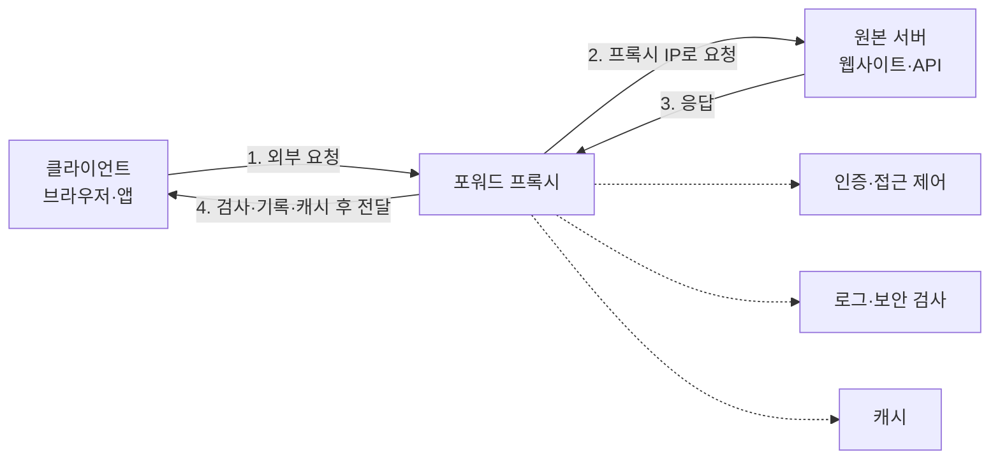

포워드 프록시(Forward Proxy)는 **클라이언트를 대신해 외부 서버에 요청을 보내는 중개 서버**이다.



## 기본 동작 원리

클라이언트가 `https://example.com`에 접속한다고 가정한다.

1. 브라우저나 운영체제에 프록시 주소가 설정되어 있다.
2. 클라이언트는 `example.com`에 직접 연결하지 않고 프록시에 요청한다.
3. 프록시는 사용자를 인증하고 접근 정책을 검사한다.
4. 허용되면 프록시가 `example.com`과 별도의 연결을 맺는다.
5. 원본 서버의 응답을 받아 클라이언트에게 전달한다.
6. 필요하면 요청과 응답을 기록하거나 검사하고, 캐시할 수 있다.

원본 서버의 네트워크 관점에서는 일반적으로 클라이언트가 아니라 **프록시의 공인 IP 주소**가 접속한 것으로 보인다.

다만 이것이 완전한 익명성을 의미하지는 않는다. 프록시가 다음과 같은 헤더를 추가할 수 있기 때문이다.

```
Forwarded: for=192.0.2.10
X-Forwarded-For: 192.0.2.10
Via: 1.1 corporate-proxy
```

또한 로그인 계정, 쿠키, 브라우저 지문 등으로 사용자를 식별할 수도 있다.

## 일반 HTTP 요청은 어떻게 처리될까?

HTTP 프록시를 사용할 때 클라이언트는 보통 요청 대상의 전체 URL을 프록시에게 보낸다.

```
GET http://example.com/products?id=10 HTTP/1.1
Host: example.com
```

직접 연결할 때 요청 경로가 보통 다음과 같은 형태인 것과 차이가 있다.

```
GET /products?id=10 HTTP/1.1
Host: example.com
```

프록시는 전체 URL을 보고 다음 작업을 할 수 있다.

- 특정 사이트나 URL 차단
- 요청 헤더 추가·삭제
- 악성 파일 검사
- 사용자별 접근 정책 적용
- 응답 콘텐츠 캐싱
- 요청 및 응답 기록
- 콘텐츠 수정

HTTP는 암호화되지 않기 때문에 프록시는 URL 경로, 헤더, 쿠키, 요청 본문과 응답 내용을 모두 볼 수 있다.

## HTTPS는 `CONNECT` 터널을 사용한다

HTTPS에서는 일반적으로 프록시가 암호화된 내용을 직접 처리하지 않고, 목적지까지 TCP 터널을 만들어 줍다.

클라이언트가 먼저 프록시에 다음 요청을 보낸다.

```
CONNECT example.com:443 HTTP/1.1
Host: example.com:443
```

프록시가 접속을 허용하면 다음과 같이 응답한다.

```
HTTP/1.1 200 Connection Established
```

그 이후의 흐름은 다음과 같다.

```
클라이언트
   │
   │ CONNECT example.com:443
   ▼
포워드 프록시
   │
   │ TCP 연결 생성
   ▼
example.com:443

이후 TLS 암호화 데이터를 프록시가 양방향으로 중계
```

일반적인 `CONNECT` 터널에서는 TLS 연결의 실제 종단점이 다음과 같다.

```
클라이언트 ←──── TLS 암호화 ────→ 원본 서버
                 │
           프록시는 바이트 중계
```

따라서 프록시는 보통 다음 정보는 알 수 있다.

- 접속한 대상 호스트와 포트
- 사용자와 클라이언트 IP
- 접속 시각과 지속 시간
- 전송한 데이터 양
- 연결 성공 또는 실패 여부

하지만 다음 내용은 TLS로 암호화되어 볼 수 없다.

- 구체적인 URL 경로
- HTTP 헤더와 쿠키
- 요청 본문
- 응답 콘텐츠

중요한 점은 **`CONNECT` 자체가 HTTPS 복호화 기능은 아니라는 것**이다.

## TLS 검사 또는 HTTPS 가로채기

회사나 학교에서는 보안 검사를 위해 TLS Inspection, HTTPS Inspection 또는 SSL Interception이라고 불리는 구성을 사용하기도 한다.

이때 프록시는 단순한 터널이 아니라 두 개의 TLS 연결을 만든다.

```
클라이언트 ←─ TLS 1 ─→ 프록시 ←─ TLS 2 ─→ 원본 서버
```

프록시는 원본 서버의 인증서 대신 자체적으로 생성한 인증서를 클라이언트에게 보여 준다. 이를 신뢰시키기 위해 조직이 관리하는 컴퓨터에 자체 루트 인증서를 설치한다.

이 구성에서는 프록시가 HTTPS 요청의 URL, 헤더, 본문과 응답을 복호화하여 검사할 수 있다. 하지만 다음과 같은 부담이 생긴다.

- 프록시 운영자를 매우 강하게 신뢰해야 함
- 개인정보와 법적·감사 정책 필요
- 프록시 침해 시 민감한 데이터가 노출될 수 있음
- 인증서 고정(Certificate Pinning)을 사용하는 앱이 실패할 수 있음
- mTLS를 사용하는 시스템과 충돌할 수 있음
- 금융·의료 사이트 등에 예외 정책이 필요할 수 있음
- 프록시가 오래된 TLS 설정을 사용하면 전체 보안이 약화될 수 있음

## 포워드 프록시를 설정하는 방식

### 명시적 프록시

브라우저나 운영체제에 프록시 주소를 직접 설정한다.

```
프록시 주소: proxy.company.internal
포트: 3128
```

클라이언트가 프록시의 존재를 알고 있다는 것이 특징이다.

### PAC 파일

PAC(Proxy Auto-Configuration) 파일은 요청 주소에 따라 프록시 사용 여부를 결정한다.

```
function FindProxyForURL(url, host) {
  if (dnsDomainIs(host, ".company.internal")) {
    return "DIRECT";
  }

  return "PROXY proxy.company.internal:3128";
}
```

예를 들어 내부 서비스는 직접 연결하고 인터넷 요청만 프록시로 전달할 수 있다.

### 투명·인터셉트 프록시

클라이언트에 프록시를 명시적으로 설정하지 않고, 라우터나 네트워크 장비가 트래픽을 프록시로 전달한다.

HTTP에는 비교적 쉽게 적용할 수 있지만 HTTPS 콘텐츠까지 검사하려면 여전히 클라이언트가 조직의 인증서를 신뢰하도록 구성해야 한다.

## 주요 종류

### HTTP 포워드 프록시

HTTP 프로토콜을 이해한다.

- URL 및 헤더 기반 정책 적용
- HTTP 인증
- HTTP 응답 캐싱
- HTTPS에 대해서는 주로 `CONNECT` 터널 제공

프록시 인증에 실패하면 원본 서버의 `401`이 아니라 일반적으로 다음 응답을 받는다.

```
HTTP/1.1 407 Proxy Authentication Required
```

### SOCKS 프록시

SOCKS는 HTTP 의미를 해석하기보다는 TCP 연결을 범용적으로 중계한다.

- 웹뿐 아니라 SSH, 데이터베이스 등에도 사용 가능
- SOCKS5는 인증과 UDP 전달을 지원할 수 있음
- 보통 HTTP URL이나 헤더 기반 필터링에는 적합하지 않음

SOCKS5에서는 DNS를 누가 조회하는지도 중요하다.

- 로컬 DNS: 클라이언트가 도메인을 IP로 변환
- 프록시 DNS: 도메인 이름을 프록시로 보내 프록시가 조회

예를 들어 `curl`에서 `socks5h`의 `h`는 프록시 측에서 호스트 이름을 해석하라는 의미이다.

```
curl --proxy socks5h://127.0.0.1:1080 https://example.com
```

### 보안 웹 게이트웨이

기업용 포워드 프록시에 다음 기능을 결합한 형태이다.

- 사용자 인증
- URL 카테고리 필터링
- 악성코드 검사
- 데이터 유출 방지
- TLS 검사
- 감사 로그
- 클라우드 애플리케이션 제어

## 장점과 단점

### 장점

- 인터넷 접근 정책을 중앙에서 관리할 수 있음
- 인증과 사용자별 권한 적용 가능
- 악성 목적지로의 연결 차단 가능
- 외부 서비스에 노출되는 IP를 통일할 수 있음
- 감사와 사고 조사에 필요한 로그 확보
- 캐시 적중 시 지연과 대역폭 사용 감소
- 내부 클라이언트가 외부와 직접 연결하지 않도록 통제

### 단점

- 프록시를 거치면서 지연 시간이 증가할 수 있음
- 처리량이 부족하면 병목이 됨
- 이중화하지 않으면 단일 장애점이 됨
- 프록시 운영자가 사용자의 접속 기록을 볼 수 있음
- HTTPS 콘텐츠는 기본 터널만으로 검사할 수 없음
- TLS 검사는 보안·개인정보·호환성 문제를 추가함
- PAC 파일, 인증, 예외 정책 및 우회 경로 관리가 복잡함
- 잘못 구성된 프록시는 공격자가 내부망에 접근하는 발판이 될 수 있음

## 운영 시 중요한 보안 사항

- 인증되지 않은 공개 프록시로 운영하지 않기
- 사용자와 장비별 인증 적용
- 목적지 및 포트 허용 목록 구성
- 내부 IP, 링크 로컬 주소와 클라우드 메타데이터 주소 접근 차단
- 직접 인터넷 연결을 방화벽에서 제한
- 로그의 보관 기간과 접근 권한 관리
- 민감정보가 로그에 남지 않도록 마스킹
- 고가용성과 용량 제한 구성
- TLS 검사 예외 및 인증서 수명주기 관리
- DNS 요청이 의도하지 않은 경로로 새지 않는지 확인

**포워드 프록시는 클라이언트 앞에 서서 클라이언트 대신 외부로 나가며, 그 과정에서 외부 접근을 통제·기록·검사하는 시스템**이다.