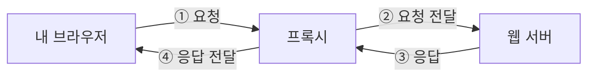

## 프록시란?

**프록시(Proxy)는 클라이언트와 서버 사이에서 통신을 대신 받아 전달하는 중개자**이다.

클라이언트는 웹브라우저나 앱처럼 요청을 보내는 프로그램이고, 서버는 그 요청을 처리하는 컴퓨터나 프로그램이다.

프록시를 사용하면 브라우저의 요청이 프록시를 거쳐 웹서버로 전달되고, 응답도 프록시를 거쳐 돌아온다. 프록시는 별도 서버에서 실행될 수도 있고, 내 컴퓨터에서 실행되는 프로그램일 수도 있다.



중간에 프록시를 두면 **통신이 지나가는 한곳에서 접근 허용, 요청 분배, 기록, 캐싱 등을 처리**할 수 있다.

누구를 대신하는지에 따라 크게 **포워드 프록시**와 **리버스 프록시**로 나뉜다.

## 프록시의 주요 기능과 한계

프록시에서 사용할 수 있는 주요 기능은 다음과 같다. 실제 제공 여부는 제품과 설정에 따라 달라진다.

|기능|하는 일|예시|
|---|---|---|
|접근 제어|요청을 허용하거나 차단|회사에서 특정 사이트 접속 제한|
|요청 라우팅|요청에 맞는 서버 선택|`/orders`를 주문 서버로 전달|
|로드 밸런싱|여러 서버에 요청 분배|서버 A와 B에 접속 부하 분산|
|캐싱|재사용 가능한 응답을 저장했다가 제공|자주 요청하는 이미지를 저장|
|기록과 관찰|요청과 오류 등의 정보 수집|접속 기록을 바탕으로 장애 분석|

**캐싱**을 사용하면 원래 서버에 매번 요청하지 않고 저장된 응답을 제공할 수 있어 서버 작업과 네트워크 사용량을 줄일 수 있다.

반면 프록시를 거치는 단계가 추가되면 지연이 늘 수 있다. 프록시가 과부하 상태이거나 멀리 있으면 속도가 느려질 수 있고, 프록시에 장애가 발생하면 이를 거치는 통신도 영향을 받는다.

따라서 성능은 프록시의 위치, 처리 능력, 캐시 활용 여부에 영향을 받는다.

## 프록시와 HTTPS

프록시를 이해할 때는 **암호화가 어디에서 시작되고 끝나는지**를 구분해야 한다. 프록시라는 역할 자체가 모든 통신을 암호화해 주는 것은 아니다.

### 암호화되지 않은 HTTP 통신

HTTP 요청을 프록시가 처리하면, 프록시는 요청 주소와 헤더, 본문을 읽을 수 있다.

따라서 요청에 민감한 정보가 포함되어 있다면 프록시 운영자도 그 정보를 볼 수 있는 구조이다.

### HTTPS 터널링

HTTPS 웹사이트에 일반적인 HTTP 프록시를 통해 접속할 때는 흔히 다음 과정을 사용한다.

1. 브라우저가 프록시에 `CONNECT example.com:443`을 보낸다.
2. 프록시가 해당 서버까지 연결 통로인 **터널**을 만든다.
3. 브라우저와 웹사이트가 그 터널을 통해 TLS 암호화 연결을 맺는다.
4. 프록시는 암호화된 데이터를 양방향으로 전달한다.

이 방식에서는 프록시가 목적지 주소와 포트, 통신 시점과 데이터 양 등을 알 수 있지만, 정상적인 TLS 연결 안의 비밀번호나 페이지 내용은 읽을 수 없다.

**`CONNECT`는 통로를 만들고, 그 안의 HTTPS 통신을 암호화하는 것은 TLS이다.**

### HTTPS 내용을 검사하는 프록시

회사 보안 장비나 디버깅 프록시가 HTTPS 검사를 수행하면 구조가 달라진다.

기기가 해당 프록시의 인증기관을 신뢰하도록 설정되어 있다면, 프록시는 두 개의 TLS 연결 사이에서 내용을 복호화해 검사할 수 있다.

```
브라우저 ← 암호화 연결 A → 검사 프록시 ← 암호화 연결 B → 웹사이트
```

따라서 HTTPS를 사용하더라도, 기기에 신뢰하도록 등록된 인증서와 프록시 구성에 따라 중간에서 내용을 볼 수 있는 주체가 달라진다.

### 리버스 프록시의 TLS 종료

서비스 운영자가 리버스 프록시에서 HTTPS 연결을 처리하는 구성도 흔하다. 이를 **TLS 종료(TLS termination)**라고 한다.

브라우저와 리버스 프록시 사이의 암호화가 그곳에서 끝나므로, 리버스 프록시는 요청 내용을 처리할 수 있다.

리버스 프록시와 내부 서버 사이를 다시 HTTPS로 연결할지는 별도로 구성한다.

## HTTP·HTTPS·SOCKS5 프록시의 차이

설정 화면에서 보이는 HTTP 프록시, HTTPS 프록시, SOCKS5 프록시는 **통신 방식에 관한 구분**이다.

| 종류         | 의미와 특징                                                                       |
| ---------- | ---------------------------------------------------------------------------- |
| HTTP 프록시   | HTTP 방식으로 프록시에 요청합니다. `CONNECT`를 지원하면 HTTPS 사이트 접속도 중계할 수 있다.                |
| HTTPS 프록시  | 보통 클라이언트와 프록시 사이의 연결 자체를 TLS로 보호하는 HTTP 프록시를 뜻한다.                            |
| SOCKS5 프록시 | 웹 요청의 의미에 덜 의존하며 다양한 앱의 연결을 중계합니다. 규격상 TCP와 UDP를 지원하며, 실제 지원 범위는 구현에 따라 다르다. |

특히 다음 두 가지를 구분해야 한다.

- **HTTPS 사이트 접속에 사용하는 프록시:** 목적지 웹사이트가 HTTPS라는 의미이다.
- **HTTPS로 연결하는 프록시:** 클라이언트와 프록시 사이의 연결 자체가 암호화된다는 의미이다.

또한 **SOCKS5를 사용한다는 사실만으로 데이터가 암호화되는 것은 아니다.**

## 프록시와 VPN의 차이

**VPN은 일반적인 앱 프록시보다 네트워크 전체의 통신 경로에 더 가깝게 작동한다.**

보통 가상 네트워크 인터페이스와 암호화된 터널을 만들어, 설정된 목적지로 가는 트래픽을 그 터널로 보낸다. WireGuard가 이런 방식으로 동작하는 VPN의 예시이다.

|비교|일반적인 HTTP·SOCKS 프록시|일반적인 VPN|
|---|---|---|
|적용 범위|프록시를 사용하도록 설정된 앱·연결|라우팅 정책에 포함되는 네트워크 트래픽|
|앱의 프록시 지원|보통 필요함|보통 별도 지원 없이 사용 가능|
|암호화|프로토콜과 구성에 따라 달라짐|기기와 VPN 연결 상대 사이를 보통 암호화|
|흔한 활용|웹 접속 관리, 특정 앱의 연결 중계|원격 사내망 접속, 여러 앱의 통신 경로 변경|

VPN도 회사 내부망으로 가는 통신만 처리하도록 설정할 수 있다. 이를 **분할 터널링(split tunneling)**이라고 한다.

VPN을 켰다고 모든 통신이 반드시 VPN을 거치는 것은 아니며, VPN 서버 이후의 구간에서도 HTTPS 같은 종단 서비스의 암호화가 필요하다.

## 실제 프록시 설정 읽는 방법

프록시 설정에 다음 주소가 보인다고 가정해 본다.

```
http://proxy.example.com:8080
```

각 부분의 의미는 다음과 같다.

- `http://`: 프록시에 연결하는 방식
- `proxy.example.com`: 프록시 서버 주소
- `8080`: 프록시 프로그램이 연결을 받는 포트

주소가 `127.0.0.1`이라면 **내 컴퓨터에서 실행되는 프록시 프로그램**을 가리킨다.

또한 시스템에 프록시를 설정해도 일부 앱은 자체 설정을 사용하거나 시스템 설정을 따르지 않을 수 있다. 특정 앱에서만 연결 문제가 생기면 그 앱의 프록시 설정도 확인해야 한다.

## 사용자 IP 전달

내부 서버가 직접 연결한 상대는 리버스 프록시이므로, 연결 정보만 보면 사용자가 아닌 프록시의 IP가 보일 수 있다.

이를 보완하기 위해 `Forwarded`나 `X-Forwarded-For` 헤더로 원래 사용자 정보를 전달한다.

```
X-Forwarded-For: 203.0.113.10
```

다만 이 값은 임의로 작성될 수 있다. 따라서 접근 제어나 요청 횟수 제한에 사용할 때는 **신뢰하는 프록시가 제공한 정보만 인정**해야 한다.

## 자주 발생하는 프록시 오류

| 오류                                  | 의미                                 |
| ----------------------------------- | ---------------------------------- |
| `407 Proxy Authentication Required` | 프록시 이용을 위한 인증이 필요함                 |
| `502 Bad Gateway`                   | 프록시나 게이트웨이가 다음 서버에서 유효하지 않은 응답을 받음 |
| `504 Gateway Timeout`               | 프록시나 게이트웨이가 다음 서버의 응답을 제때 받지 못했음   |

예를 들어 `504`가 발생하면 프록시가 기다리는 제한 시간과 내부 서버의 처리 시간을 함께 확인한다. 내부 서버의 느린 작업, 네트워크 문제, 프록시의 시간 제한 설정 등이 원인일 수 있다.