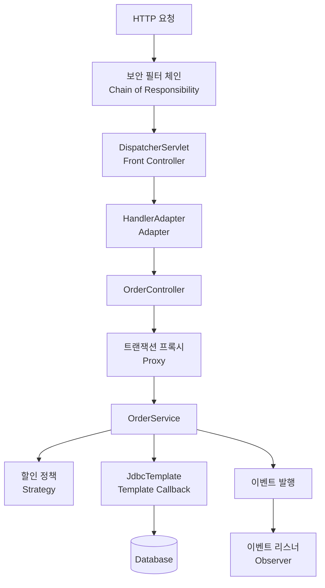

## 디자인 패턴

Spring과 Spring Boot를 디자인 패턴 관점에서 이해할 때 핵심은 **“객체의 생성·연결·실행에서 반복되는 문제를 어떤 구조로 해결하는가”**이다.

Spring은 DI, 프록시, 전략, 템플릿 등으로 객체를 유연하게 조립하고 실행한다. Spring Boot는 이 기반 위에서 **조건에 맞는 설정과 객체를 자동으로 구성**한다.

아래에서는 **패턴의 목적 → Spring의 적용 방식 → 코드 예제 → 실무 주의점** 순서로 설명한다. 예제는 Java 기준이며 import와 일부 도메인 구현은 생략했다.

---

### Spring과 Spring Boot의 역할

|구분|Spring Framework|Spring Boot|
|---|---|---|
|주요 역할|객체 관리와 애플리케이션 실행 기반 제공|Spring 애플리케이션의 구성과 실행 간소화|
|대표 기능|DI, AOP, 트랜잭션, MVC, 이벤트|자동 구성, Starter, 외부 설정, 실행 환경 구성|
|패턴 관점|객체를 어떻게 생성하고 협력시킬 것인가|필요한 객체와 설정을 어떤 조건으로 선택할 것인가|
|관계|핵심 기반|Spring을 활용하는 구성 계층|

따라서 Spring Boot에서도 Spring의 디자인 패턴이 그대로 사용된다. 두 기술이 서로 다른 패턴 체계를 가진 것은 아니다.

또한 모든 개념이 GoF의 23가지 디자인 패턴에 해당하지는 않는다.

- **GoF 패턴:** Singleton, Proxy, Strategy, Adapter, Observer 등
- **더 넓은 설계 개념:** IoC, DI, MVC, Front Controller, Repository 등
- **구성 원칙과 메커니즘:** 자동 구성, Convention over Configuration 등

이 차이를 구분하면 패턴 이름을 억지로 붙이지 않고 실제 구조를 이해할 수 있다.

---

## IoC와 DI — 객체의 생성과 연결을 외부에 맡긴다.

### 어떤 문제를 해결할까?

다음 코드는 서비스가 자신이 사용할 저장소를 직접 선택하고 생성한다.

```
public class OrderService {

    private final OrderRepository repository =
            new JdbcOrderRepository();
}
```

이 구조에서는 저장소 구현을 바꾸려면 `OrderService`도 수정해야 한다. 테스트에서 가짜 저장소를 사용하기도 불편하다.

DI를 사용하면 객체를 외부에서 전달받는다.

```
public interface OrderRepository {
    void save(Order order);
}
```

```
@Repository
public class JdbcOrderRepository implements OrderRepository {

    @Override
    public void save(Order order) {
        // JDBC를 사용한 저장 로직
    }
}
```

```
@Service
public class OrderService {

    private final OrderRepository repository;

    public OrderService(OrderRepository repository) {
        this.repository = repository;
    }

    public void place(Order order) {
        repository.save(order);
    }
}
```

Spring 컨테이너가 `JdbcOrderRepository`를 생성하고 `OrderService`의 생성자에 전달한다. 생성자가 하나이면 일반적으로 `@Autowired`를 생략할 수 있다.

### IoC와 DI의 차이

|개념|의미|
|---|---|
|IoC, 제어의 역전|객체 생성이나 실행 흐름의 제어를 프레임워크 등에 맡기는 원칙|
|DI, 의존성 주입|필요한 의존 객체를 외부에서 전달하는 방식|
|관계|DI는 IoC를 구현하는 대표적인 방법|

### 유용한 이유

`OrderService`는 저장소의 구체적인 생성 방법을 몰라도 된다. 테스트에서는 Spring을 실행하지 않고도 다음처럼 사용할 수 있다.

```
OrderRepository fakeRepository = new InMemoryOrderRepository();
OrderService service = new OrderService(fakeRepository);
```

필수 의존성에는 생성자 주입을 사용하면 의존 관계가 명확해지고, 필드를 `final`로 선언하기 쉽다. 다만 DI를 사용한다고 모든 클래스에 인터페이스가 필요한 것은 아니다.

---

## Singleton — 기본적으로 하나의 빈을 공유한다

### 패턴의 목적

여러 곳에서 같은 객체 인스턴스를 사용하도록 한다.

Spring에서 빈의 기본 스코프는 `singleton`이다.

```
@Service
public class ProductService {
}
```

여러 컨트롤러가 이 빈을 주입받으면 같은 컨테이너의 동일한 빈 인스턴스를 공유한다.

### GoF Singleton과 Spring Singleton의 차이

|구분|GoF Singleton|Spring Singleton|
|---|---|---|
|인스턴스 관리 주체|클래스 자체|Spring 컨테이너|
|일반적인 구현|`private` 생성자, 정적 인스턴스|빈 등록과 스코프 설정|
|유일성 기준|보통 클래스 로더 내 해당 클래스|컨테이너 내 개별 빈 정의|
|직접 `new` 사용|클래스 구조로 제한|별도 인스턴스를 만들 수 있음|

같은 클래스라도 서로 다른 이름으로 빈을 두 개 등록하면 각각 별도의 인스턴스가 될 수 있다. 따라서 **“Spring에서는 클래스마다 JVM 전체에 객체가 하나뿐이다”**라는 설명은 정확하지 않다.

**가장 중요한 주의점: Singleton은 스레드 안전을 보장하지 않는다**

```
@Service
public class UnsafeOrderService {

    private Long currentUserId;

    public void place(Long userId) {
        this.currentUserId = userId;
        // 다른 요청이 currentUserId를 바꿀 수 있음
    }
}
```

여러 요청이 하나의 객체를 공유하므로 사용자별 상태를 필드에 보관하면 충돌할 수 있다.

요청별 데이터는 메서드 인자와 지역 변수로 처리하는 것이 기본이다.

```
@Service
public class OrderService {

    public void place(Long userId) {
        Long currentUserId = userId;
        // 요청마다 독립적인 지역 변수 사용
    }
}
```

`final` 필드도 참조하는 객체 자체의 변경 가능성까지 없애지는 않는다. 공유 컬렉션이나 캐시가 있다면 별도의 동시성 설계가 필요하다.

---

## Factory 계열 — 객체 생성 책임을 분리한다

### 패턴의 목적

객체를 사용하는 코드와 객체를 만드는 코드를 분리한다.

Spring에서는 `BeanFactory`, `ApplicationContext`, `@Bean`, `FactoryBean`을 통해 생성 책임을 컨테이너와 설정 코드에 모을 수 있다.

```
@Configuration
public class PaymentConfig {

    @Bean
    public PaymentClient paymentClient() {
        return new PaymentClient("https://payments.example.com");
    }

    @Bean
    public PaymentService paymentService(PaymentClient client) {
        return new PaymentService(client);
    }
}
```

`PaymentService`는 클라이언트의 생성 과정이나 주소 설정을 몰라도 된다. `@Bean` 메서드가 생성 방법을 제공하고, 컨테이너가 반환된 객체를 빈으로 관리한다.

**BeanFactory와 FactoryBean은 다르다**

|이름|역할|
|---|---|
|`BeanFactory`|빈을 생성·조회·관리하는 컨테이너의 핵심 인터페이스|
|`ApplicationContext`|빈 관리에 이벤트, 리소스 등의 기능을 더한 컨테이너 인터페이스|
|`FactoryBean<T>`|복잡한 객체 생성을 캡슐화하는 특수한 빈 계약|
|`@Bean`|빈을 생성할 메서드를 선언하는 애너테이션|

예를 들어 어떤 라이브러리 객체를 생성하려면 복잡한 초기화 과정이 필요할 때 `FactoryBean<T>`으로 그 과정을 감쌀 수 있다.

**정확한 분류:** 이 구조는 Factory 계열의 생성 책임 분리를 잘 보여주지만, 모든 `@Bean` 메서드나 `BeanFactory`를 GoF의 Factory Method 또는 Abstract Factory와 일대일로 동일시할 필요는 없다.

---

## Proxy — 실제 객체 앞에서 부가 기능을 실행한다

### 패턴의 목적

실제 객체 대신 호출을 받아, 접근을 제어하거나 호출 전후에 부가 작업을 수행한다.

Spring에서는 다음 기능을 이해하는 데 중요하다.

- `@Transactional`
- `@Cacheable`
- 프록시 방식의 `@Async`
- 메서드 수준 보안
- 사용자 정의 AOP

예를 들어 다음 메서드에는 트랜잭션 시작과 커밋 코드가 없다.

```
@Service
public class OrderService {

    private final OrderRepository repository;

    public OrderService(OrderRepository repository) {
        this.repository = repository;
    }

    @Transactional
    public void place(Order order) {
        repository.save(order);
    }
}
```

프록시 방식에서는 호출이 다음처럼 진행된다.

```
호출자
  → 트랜잭션 프록시
      → 트랜잭션 시작 또는 기존 트랜잭션 참여
      → 실제 OrderService.place()
      → 설정과 실행 결과에 따라 커밋 또는 롤백 처리
```

Spring AOP는 JDK 동적 프록시 또는 CGLIB 기반 프록시를 사용한다. 구체적인 선택은 인터페이스 유무뿐 아니라 설정과 실행 환경에도 영향을 받는다.

**자주 발생하는 문제: 내부 호출**

```
@Service
public class OrderService {

    public void checkout(Order order) {
        save(order);
    }

    @Transactional
    public void save(Order order) {
        // 주문 저장
    }
}
```

외부에서 `checkout()`을 호출한 뒤 내부에서 `save()`를 호출하면, `save()` 호출은 프록시를 다시 통과하지 않는다.

따라서 기본적인 프록시 방식에서는 **`save()`의 트랜잭션 애너테이션이 이 내부 호출에 새롭게 적용되지 않는다.** 이미 바깥에서 시작된 트랜잭션이 존재하는지는 별개의 문제이다.

보통 트랜잭션 경계를 외부에서 호출하는 메서드로 옮기거나, 해당 책임을 별도 빈으로 분리한다.

**추가 주의점:** 클래스 기반 프록시는 상속을 사용하므로 `final` 클래스와 `final` 메서드에 제약이 있고, `private` 메서드도 프록시 AOP 적용 대상으로 사용할 수 없다.

---

## Strategy — 바뀌는 정책을 교체 가능한 객체로 만든다

### 패턴의 목적

알고리즘이나 정책을 인터페이스 뒤로 분리하여 교체할 수 있게 한다.

예를 들어 할인 방식이 달라질 수 있다고 가정한다.

```
public interface DiscountPolicy {
    long discount(long price);
}
```

```
@Component("fixedDiscount")
public class FixedDiscountPolicy implements DiscountPolicy {

    @Override
    public long discount(long price) {
        return Math.min(price, 1_000);
    }
}
```

```
@Component("rateDiscount")
public class RateDiscountPolicy implements DiscountPolicy {

    @Override
    public long discount(long price) {
        return price / 10;
    }
}
```

사용하는 쪽은 공통 인터페이스에 의존한다.

```
@Service
public class PriceService {

    private final DiscountPolicy policy;

    public PriceService(
            @Qualifier("rateDiscount") DiscountPolicy policy) {
        this.policy = policy;
    }

    public long finalPrice(long price) {
        return price - policy.discount(price);
    }
}
```

`PriceService`는 할인 계산 방식을 직접 구현하지 않고 주입받은 전략에 위임한다.

**DI와 Strategy의 차이**

|질문|관련 개념|
|---|---|
|의존 객체를 어떻게 전달할까?|DI|
|서로 다른 정책을 어떻게 교체할까?|Strategy|

DI는 전략 객체를 연결해 주는 수단이다. DI를 사용한다고 모든 의존 객체가 전략 패턴이 되는 것은 아니다.

또한 위 `@Qualifier` 예제는 **객체를 구성할 때 전략을 선택**한다. 요청마다 결제 방식이나 할인 정책을 선택하려면 여러 전략을 주입받고, 입력값에 맞는 전략을 찾는 별도 선택 로직이 필요하다.

**적용하기 좋은 경우:** 결제 수단, 배송비 계산, 할인 정책, 파일 변환처럼 동일한 목적의 처리 방식이 여러 개 존재하는 경우이다.

---

## Template Method와 Template Callback — 공통 흐름과 달라지는 부분을 분리한다

두 방식은 목적이 비슷하지만 확장 방식이 다르다.

|구분|Template Method|Template Callback|
|---|---|---|
|공통 처리 흐름|상위 클래스에 정의|템플릿 객체에 정의|
|달라지는 부분|하위 클래스의 재정의|전달받은 콜백|
|주요 수단|상속|위임과 합성|
|Spring 예|`AbstractApplicationContext`의 초기화 구조|`JdbcTemplate`, `TransactionTemplate`|

### Template Method

상위 클래스가 처리 순서를 정하고 일부 단계를 하위 클래스가 구현한다.

```
public abstract class ReportExporter {

    public final byte[] export(Report report) {
        validate(report);
        return render(report);
    }

    private void validate(Report report) {
        if (report == null) {
            throw new IllegalArgumentException("report is required");
        }
    }

    protected abstract byte[] render(Report report);
}
```

PDF와 CSV 구현은 `render()`를 다르게 구현하면서 동일한 검증 흐름을 사용한다.

Spring의 `AbstractApplicationContext`도 공통 초기화 흐름과 하위 클래스의 확장 지점을 제공한다.

### Template Callback

`JdbcTemplate`을 사용할 때는 보통 상속하지 않고 콜백을 전달한다.

```
public record MemberView(long id, String name) {
}
```

```
public List<MemberView> findMembers(JdbcTemplate jdbcTemplate) {
    return jdbcTemplate.query(
        "select id, name from members",
        (rs, rowNum) -> new MemberView(
            rs.getLong("id"),
            rs.getString("name")
        )
    );
}
```

역할은 다음처럼 나뉜다.

|`JdbcTemplate`이 담당|개발자가 제공|
|---|---|
|JDBC 자원 획득과 정리|SQL|
|SQL 실행 처리|파라미터|
|JDBC 예외 변환|결과를 객체로 변환하는 콜백|

이때 람다는 `RowMapper` 콜백입니다.

**핵심 구분:** `JdbcTemplate`을 단순히 “상속 기반 Template Method의 예”로 외우기보다, 공통 흐름을 템플릿이 맡고 변경 지점을 콜백으로 받는 구조로 이해하는 것이 정확하다.

---

## Adapter — 서로 다른 호출 방식을 공통 인터페이스로 연결한다

### 패턴의 목적

서로 맞지 않는 인터페이스 사이를 변환하여 협력할 수 있게 한다.

Spring MVC의 대표적인 예는 `HandlerAdapter`이다.

컨트롤러나 핸들러의 형태가 달라질 때마다 `DispatcherServlet`에 호출 코드를 추가하면 중앙 처리 로직이 복잡해진다.

Spring은 이를 다음처럼 분리한다.

```
DispatcherServlet
  → HandlerAdapter의 공통 호출 방식
      → 실제 핸들러에 맞는 호출로 변환
```

예를 들어 애너테이션 기반 컨트롤러의 핸들러 메서드는 `RequestMappingHandlerAdapter`가 처리한다. `DispatcherServlet`은 핸들러별 세부 호출 방식을 직접 알 필요가 없다.

### Strategy와 Adapter의 차이

- **Strategy:** 같은 목적을 수행하는 여러 알고리즘을 교체한다.
- **Adapter:** 서로 다른 호출 규약을 연결한다.

애플리케이션 코드에서는 외부 결제 SDK나 문자 발송 API를 내부 인터페이스에 맞춰 감쌀 때 유용하다. 외부 라이브러리가 바뀌어도 변경 범위를 어댑터에 모을 수 있다.

---

## Observer — 사건의 발생과 후속 반응을 분리한다

### 패턴의 목적

이벤트를 발생시키는 객체가 모든 후속 처리 객체를 직접 알지 않아도 되게 한다.

예를 들어 회원 가입 후 환영 메시지를 처리할 수 있다.

```
public record MemberJoinedEvent(Long memberId) {
}
```

```
@Service
public class MemberService {

    private final ApplicationEventPublisher publisher;

    public MemberService(ApplicationEventPublisher publisher) {
        this.publisher = publisher;
    }

    public void notifyJoined(Long memberId) {
        publisher.publishEvent(new MemberJoinedEvent(memberId));
    }
}
```

```
@Component
public class WelcomeListener {

    @EventListener
    public void handle(MemberJoinedEvent event) {
        // 환영 메시지 처리
    }
}
```

회원 서비스는 리스너를 직접 호출하지 않고 “회원이 가입했다”는 사실을 발행한다. 새로운 후속 처리가 필요하면 리스너를 추가할 수 있다.

Spring의 애플리케이션 이벤트는 Observer 방식으로 이해할 수 있으며, 기본 이벤트 멀티캐스터 구성에서는 일반 리스너가 동기적으로 실행된다. **이벤트를 발행했다고 자동으로 비동기 처리가 되는 것은 아니다.**

### 트랜잭션과 결합할 때

DB 저장이 실제로 커밋된 후 처리해야 한다면 다음 방식을 사용할 수 있다.

```
@TransactionalEventListener(phase = TransactionPhase.AFTER_COMMIT)
public void handle(MemberJoinedEvent event) {
    // 회원 가입 트랜잭션이 커밋된 뒤 처리
}
```

기본적으로 활성 트랜잭션이 없는 상태에서 발행한 이벤트에는 이 리스너가 실행되지 않는다. 트랜잭션이 없어도 처리하려면 별도 설정이 필요하다. 

또한 커밋 후 리스너에서 실패해도 이미 완료된 원래 커밋이 취소되지는 않는다. 프로세스 종료에도 유실되지 않는 전달이나 재시도가 필요하다면 영속 메시징이나 Outbox 같은 별도 설계를 검토해야 한다.

---

## Chain of Responsibility — 여러 처리 단계를 연결한다

### 패턴의 목적

여러 처리기를 연결하고 각 처리기가 다음 단계로 넘기거나 처리를 종료하도록 한다.

Servlet Filter와 Spring Security의 필터 체인이 대표적이다.

```
요청
  → 필터 A
  → 필터 B
  → 필터 C
  → DispatcherServlet
```

각 필터는 다음 작업을 할 수 있다.

- 다음 단계로 요청 전달
- 요청·응답 가공
- 후속 처리 차단 및 응답 반환
- 다음 단계 실행 전후에 부가 처리

필터의 핵심 구조는 다음과 같다.

```
public void doFilter(
        ServletRequest request,
        ServletResponse response,
        FilterChain chain
) throws IOException, ServletException {

    // 다음 단계 실행 전 처리

    chain.doFilter(request, response);

    // 다음 단계가 정상 반환한 후 처리
}
```

예외 발생 시에도 반드시 수행해야 하는 정리 작업은 `finally`에서 처리해야 한다.

Spring Security에서는 `FilterChainProxy`가 요청에 맞는 `SecurityFilterChain`을 선택한다. 여러 체인이 있더라도 **처음 매칭된 체인이 선택**되며, 그 체인 내부의 필터들이 순서대로 동작한다.

**실무 포인트:** 필터 순서는 동작에 영향을 준다. 예를 들어 사용자 인증 결과를 사용하는 단계는 필요한 인증 처리 이후에 위치해야 한다.

---

## Front Controller와 MVC — 웹 요청 처리를 중앙에서 조율한다

### Front Controller

웹 요청의 공통 진입점에서 처리 흐름을 조율하는 패턴이다. Spring MVC에서는 `DispatcherServlet`이 담당한다.

대표적인 흐름은 다음과 같다.

```
HTTP 요청
  → DispatcherServlet
  → HandlerMapping으로 핸들러 탐색
  → HandlerAdapter로 핸들러 실행
  → 반환값 처리
      ├─ View 렌더링
      └─ 응답 본문 변환
```

이 구조 덕분에 요청 매핑, 핸들러 실행, 예외 처리, 응답 처리 등을 공통 흐름에서 조율할 수 있다.

### MVC와 계층 구조는 구분해야 한다

|구조|분리하는 책임|
|---|---|
|MVC|Model, View, Controller|
|Controller–Service–Repository|웹 처리, 비즈니스 처리, 데이터 접근|

`Controller → Service → Repository`는 흔히 사용하는 계층 구조이지, 그 세 계층이 MVC의 세 요소와 각각 대응하는 것은 아니다.

또한 `@RestController`에서는 보통 HTML View를 렌더링하는 대신 반환값을 메시지 컨버터로 변환해 JSON 등의 응답 본문으로 전달한다.

---

## Spring Boot 자동 구성 — 조건에 맞는 기본 구성을 제공한다

Spring Boot의 핵심은 개발자가 매번 작성해야 하는 설정을 줄이는 것이다.

자동 구성은 클래스패스, 기존 빈, 설정값 등을 확인하여 필요한 구성을 적용한다. 사용자가 직접 구성하면 해당 자동 구성이 물러나도록 설계된 경우도 많다.

### 간단한 자동 구성 예제

다음은 라이브러리에서 기본 `Clock` 빈을 제공하는 예시이다.

```
@AutoConfiguration
public class ClockAutoConfiguration {

    @Bean
    @ConditionalOnMissingBean(Clock.class)
    public Clock applicationClock() {
        return Clock.systemUTC();
    }
}
```

사용자가 다음처럼 자신의 빈을 제공하면 위 기본 빈은 등록되지 않는다.

```
@Configuration
public class ApplicationClockConfig {

    @Bean
    public Clock applicationClock() {
        return Clock.system(ZoneId.of("Asia/Seoul"));
    }
}
```

라이브러리의 자동 구성 클래스를 발견하도록 하려면 다음 리소스 파일에 클래스의 전체 이름을 등록한다.

```
META-INF/spring/org.springframework.boot.autoconfigure.AutoConfiguration.imports
```

```
com.example.time.ClockAutoConfiguration
```

### 대표적인 조건

|애너테이션|적용 조건|
|---|---|
|`@ConditionalOnClass`|지정한 클래스가 존재|
|`@ConditionalOnMissingBean`|지정한 빈이 없음|
|`@ConditionalOnProperty`|설정값이 지정 조건을 만족|
|`@ConditionalOnWebApplication`|웹 애플리케이션 환경|

이 조건들은 주로 **컨테이너를 구성할 때** 평가된다. 요청마다 전략을 선택하는 기능과는 다르다.

### 어떤 디자인 패턴으로 볼 수 있을까?

자동 구성 전체를 특정 GoF 패턴 하나로 설명하기보다는 다음 요소가 결합한 구조로 보는 것이 적절하다.

- **Factory 방식의 생성 책임 분리:** 설정 코드가 빈 생성 방법을 제공
- **DI:** 생성된 객체를 필요한 곳에 연결
- **조건부 구성:** 환경에 맞는 빈과 설정 선택
- **기본값과 사용자 확장:** 기본 구현을 제공하되 사용자 정의를 허용

Starter는 주로 필요한 의존성을 묶어 제공하고, 자동 구성은 그 의존성과 환경을 바탕으로 빈을 구성한다. 두 역할 역시 구분해야 한다.

---

## 실제 요청에서는 여러 패턴이 함께 작동한다

Spring Boot 기반 주문 API를 생각하면 패턴들이 다음처럼 연결될 수 있다.

````

````

이 다이어그램에서 **DI는 객체들을 연결하는 방식**, **Singleton은 빈의 공유 범위**, **자동 구성은 필요한 기반 객체를 준비하는 방식**이다.

즉, 하나의 요청을 설명할 때도 패턴마다 담당하는 관점이 다르다.

---

## 핵심 요약

|개념|기억할 핵심|흔한 오해|
|---|---|---|
|DI|의존 객체를 외부에서 전달|인터페이스가 반드시 필요하다|
|Singleton|컨테이너 내 빈을 공유|자동으로 스레드 안전하다|
|Factory 계열|생성 책임과 사용 책임 분리|`BeanFactory`와 `FactoryBean`이 같다|
|Proxy|호출을 가로채 부가 기능 수행|내부 호출에도 애너테이션이 적용된다|
|Strategy|바뀌는 정책을 객체로 분리|DI와 같은 개념이다|
|Template Callback|공통 흐름에 콜백을 전달|항상 상속으로 확장한다|
|Adapter|서로 다른 호출 규약 연결|알고리즘 교체와 동일하다|
|Observer|사건 발생과 후속 반응 분리|이벤트는 항상 비동기·영속적이다|
|Chain of Responsibility|처리기를 순서대로 연결|모든 보안 체인이 실행된다|
|자동 구성|조건에 맞는 기본 구성 제공|실행 중 언제나 구성이 자동 변경된다|
