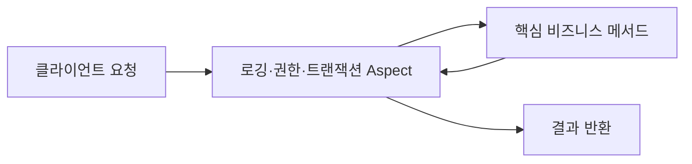

## AOP

AOP는 소프트웨어 개발의 **Aspect-Oriented Programming, 관점 지향 프로그래밍**을 뜻한다.

AOP는 여러 비즈니스 기능에 반복해서 나타나는 공통 로직을 분리하고, 필요한 지점에 자동으로 적용하는 프로그래밍 방식이다. 로깅, 트랜잭션, 권한 검사, 성능 측정 등이 대표적이다.

## AOP 필요 여부

온라인 주문 서비스를 예를 들면

```
public void createOrder() {
    log.info("createOrder 시작");
    checkPermission();
    beginTransaction();

    // 실제 주문 생성 로직
    orderRepository.save(order);

    commitTransaction();
    log.info("createOrder 종료");
}
```

결제 메서드에도 비슷한 코드가 들어갈 수 있다.

```
public void pay() {
    log.info("pay 시작");
    checkPermission();
    beginTransaction();

    // 실제 결제 로직
    paymentGateway.pay();

    commitTransaction();
    log.info("pay 종료");
}
```

여기서 주문 생성과 결제는 서로 다른 비즈니스 기능이지만 다음 기능은 반복된다.

- 로그 기록
- 권한 확인
- 트랜잭션 처리
- 실행 시간 측정
- 예외 기록

이처럼 여러 모듈을 가로질러 나타나는 기능을 **횡단 관심사(Cross-cutting Concern)**라고 한다.

반대로 주문 생성이나 결제처럼 애플리케이션의 핵심 목적을 구현하는 기능은 **핵심 관심사(Core Concern)**이다.

AOP의 핵심 아이디어는 간단하다.

> 핵심 비즈니스 코드에서는 횡단 관심사를 제거하고, 별도의 모듈로 작성한 뒤 필요한 실행 지점에 적용한다.

````

````

## AOP 주요 용어

### Aspect

횡단 관심사를 하나의 모듈로 정의한 것이다.

예를 들어 성능 측정 Aspect에는 다음 두 가지가 포함된다.

- 어느 메서드를 측정할 것인가
- 메서드 실행 전후에 어떤 처리를 할 것인가

### Join Point

부가 기능을 적용할 수 있는 프로그램 실행 지점이다.

가능한 예는 다음과 같다.

- 메서드 호출
- 메서드 실행
- 생성자 실행
- 필드 접근
- 예외 발생

어떤 Join Point를 지원하는지는 AOP 구현 방식에 따라 다르다. 예를 들어 일반적인 Spring 프록시 기반 AOP는 주로 **메서드 실행**을 대상으로 한다. AspectJ는 생성자나 필드 접근 등 더 다양한 지점을 다룰 수 있다.

### Pointcut

수많은 Join Point 가운데 실제로 부가 기능을 적용할 대상을 선택하는 표현식이다.

예를 들어 다음과 같은 조건을 표현할 수 있다.

- `service` 패키지에 있는 모든 메서드
- `@Transactional`이 붙은 메서드
- 이름이 `find`로 시작하는 메서드
- 특정 인터페이스를 구현한 클래스의 메서드

쉽게 말하면 다음과 같다.

- Join Point: 적용 가능한 모든 후보
- Pointcut: 그중 실제로 선택한 대상

### Advice

선택된 지점에서 실행할 부가 기능이다.

Advice는 실행 시점에 따라 나뉜다.

|Advice|실행 시점|
|---|---|
|Before|대상 메서드 실행 전|
|After Returning|메서드가 정상적으로 반환된 후|
|After Throwing|메서드에서 예외가 발생한 후|
|After|정상 종료 또는 예외와 관계없이 실행 후|
|Around|메서드 실행 전후 전체를 감쌈|

`Around` Advice가 가장 강력하다. 대상 메서드를 실행할지, 결과를 바꿀지, 예외를 처리할지까지 결정할 수 있기 때문이다. 그만큼 남용하면 실행 흐름을 이해하기 어려워진다.

### Target

AOP 부가 기능이 적용되는 실제 객체이다. 예를 들어 `OrderService`가 대상 객체가 될 수 있다.

### Proxy

대상 객체를 대신해서 요청을 받는 중간 객체이다.

클라이언트가 `OrderService`를 직접 호출하는 것처럼 보여도 실제 실행 흐름은 다음과 같을 수 있다.

```
클라이언트
   ↓
OrderService 프록시
   ↓  로깅, 권한 검사, 트랜잭션 시작
실제 OrderService
   ↓
OrderService 프록시
   ↓  트랜잭션 종료, 실행 시간 기록
클라이언트
```

### Weaving

Aspect를 실제 대상 코드에 연결하는 과정이다.

주요 방식은 다음과 같다.

- **컴파일 시점 위빙**: 소스 코드를 컴파일할 때 Aspect를 결합
- **로드 시점 위빙**: 클래스가 JVM에 로드될 때 결합
- **실행 시점 위빙**: 실행 중 프록시 등을 만들어 결합

Spring의 일반적인 AOP는 실행 시점에 프록시를 만드는 방식이고, AspectJ는 컴파일 시점 또는 로드 시점 위빙도 지원한다.

## Spring 방식의 간단한 예시

다음은 특정 애너테이션이 붙은 메서드의 실행 시간을 측정하는 예시이다.

먼저 애너테이션을 정의한다.

```
@Target(ElementType.METHOD)
@Retention(RetentionPolicy.RUNTIME)
public @interface MeasureTime {
}
```

실행 시간을 측정하는 Aspect를 만든다.

```
@Aspect
@Component
public class PerformanceAspect {

    @Around("@annotation(MeasureTime)")
    public Object measure(ProceedingJoinPoint joinPoint) throws Throwable {
        long start = System.nanoTime();

        try {
            return joinPoint.proceed();
        } finally {
            long elapsed = System.nanoTime() - start;

            System.out.println(
                joinPoint.getSignature().toShortString()
                + " 실행 시간: "
                + elapsed / 1_000_000.0
                + "ms"
            );
        }
    }
}
```

대상 메서드에는 애너테이션만 붙인다.

```
@Service
public class OrderService {

    @MeasureTime
    public void createOrder() {
        // 주문 생성이라는 핵심 로직만 작성
    }
}
```

호출 흐름은 다음과 같다.

1. 클라이언트가 `createOrder()`를 호출한다.
2. 프록시가 호출을 먼저 받는다.
3. `PerformanceAspect`가 시작 시간을 기록한다.
4. `joinPoint.proceed()`가 실제 메서드를 호출한다.
5. 메서드가 끝나면 경과 시간을 계산한다.
6. 결과 또는 예외가 호출자에게 전달된다.

`proceed()`를 호출하지 않으면 실제 대상 메서드가 실행되지 않는다는 점이 중요하다.

## AOP가 적합한 기능

AOP는 여러 클래스에 동일한 규칙으로 적용할 수 있는 기능에 적합하다.

- 트랜잭션 시작, 커밋 및 롤백
- 인증과 권한 검사
- 메서드 호출 로깅
- 실행 시간과 메트릭 수집
- 감사 로그
- 재시도
- 캐싱
- 분산 추적
- 예외 변환
- 사용량 제한

예를 들어 선언적 트랜잭션은 AOP의 대표적인 활용이다.

```
@Transactional
public void transfer(Account from, Account to, Money amount) {
    from.withdraw(amount);
    to.deposit(amount);
}
```

개발자는 트랜잭션을 직접 시작하고 커밋하는 코드를 작성하지 않는다. 프레임워크가 프록시를 통해 대략 다음 역할을 수행한다.

```
트랜잭션 시작
    → transfer() 실행
        → 정상 종료: 커밋
        → 예외 발생: 롤백
```

## AOP와 OOP의 관계

AOP는 OOP를 대체하지 않는다.

OOP는 주로 책임과 데이터를 객체 단위로 분리한다.

```
OrderService
PaymentService
InventoryService
```

하지만 로깅이나 트랜잭션은 여러 객체를 가로질러 나타난다.

```
                 로깅
                   ↓
OrderService ─ PaymentService ─ InventoryService
                   ↑
                트랜잭션
```

즉, 두 방식의 분리 기준이 다르다.

- OOP: 객체와 책임을 기준으로 수직 분리
- AOP: 여러 객체에 공통으로 나타나는 관심사를 기준으로 수평 분리

## AOP와 비슷한 기술의 차이

### 데코레이터 패턴

데코레이터도 객체를 감싸서 부가 기능을 추가한다. 다만 일반적으로 개발자가 객체 조립과 적용 관계를 명시적으로 구성한다.

AOP는 Pointcut 규칙을 이용하여 여러 대상에 일괄 적용할 수 있다. 프록시 기반 AOP는 내부적으로 데코레이터와 비슷한 구조를 사용할 수 있다.

### 인터셉터

인터셉터는 HTTP 요청이나 프레임워크의 특정 실행 경로를 가로채는 데 주로 사용된다.

- HTTP 인증이나 요청 로깅: 필터 또는 인터셉터가 자연스러움
- 서비스 메서드의 트랜잭션이나 성능 측정: AOP가 자연스러움

### 미들웨어

미들웨어는 일반적으로 요청 처리 파이프라인 전체에 적용된다. AOP는 패키지, 메서드, 애너테이션, 매개변수 같은 더 세밀한 조건을 이용할 수 있다.

## 프록시 기반 AOP의 주의점

### 내부 호출 문제

프록시 기반 AOP에서 가장 흔한 문제이다.

```
@Service
public class OrderService {

    public void createOrder() {
        validateOrder();
    }

    @MeasureTime
    public void validateOrder() {
        // 검증
    }
}
```

외부에서 `createOrder()`를 호출하면 프록시를 거치지만, `createOrder()` 내부의 `validateOrder()` 호출은 일반적으로 같은 객체의 `this.validateOrder()` 호출이다.

```
외부 → 프록시 → createOrder()
                    ↓
              this.validateOrder()
```

두 번째 호출은 프록시를 다시 통과하지 않으므로 `validateOrder()`에 설정한 Advice가 적용되지 않을 수 있다. 이를 흔히 **self-invocation 문제**라고 한다.

보통은 다음과 같이 해결한다.

- AOP 경계가 필요한 메서드를 별도 서비스로 분리
- 프록시를 통한 외부 호출 구조로 변경
- 프록시보다 더 넓은 Join Point를 지원하는 위빙 방식 사용

프록시를 직접 꺼내 자기 자신을 호출하게 만드는 해결책도 있지만, 코드가 프레임워크와 강하게 결합되므로 신중해야 한다.

### 메서드 가시성과 클래스 구조

프록시 생성 방식에 따라 다음 요소가 영향을 줄 수 있다.

- 인터페이스 구현 여부
- `final` 클래스 또는 `final` 메서드
- `private` 메서드
- 생성자를 통한 직접 객체 생성
- 프레임워크 컨테이너 밖에서 만든 객체

예를 들어 개발자가 `new OrderService()`로 객체를 직접 생성하면, 컨테이너가 관리하는 프록시가 아니라 실제 객체를 호출하게 되어 AOP가 적용되지 않을 수 있다.

### Advice 실행 순서

한 메서드에 보안, 트랜잭션, 로깅, 재시도 Aspect가 모두 적용되면 실행 순서가 중요하다.

```
보안 검사
  → 재시도
    → 트랜잭션
      → 로깅
        → 비즈니스 메서드
```

재시도가 트랜잭션 바깥에 있는지 안에 있는지에 따라 매번 새로운 트랜잭션이 생성되는지가 달라질 수 있다. 여러 Aspect가 겹친다면 순서를 명시하고 테스트하는 것이 좋다.

### 예외 처리

`Around` Advice에서 예외를 무심코 삼키면 호출자는 실패를 알 수 없다.

```
try {
    return joinPoint.proceed();
} catch (Exception e) {
    log.error("실패", e);
    return null; // 위험할 수 있음
}
```

관찰을 위한 로깅 Aspect라면 보통 예외를 기록한 뒤 다시 던져야 한다.

```
try {
    return joinPoint.proceed();
} catch (Throwable e) {
    log.error("실패", e);
    throw e;
}
```

### 비동기와 실행 컨텍스트

비동기 처리에서는 스레드가 바뀔 수 있다. `ThreadLocal`에 저장한 사용자 정보, 트레이스 ID 또는 트랜잭션 컨텍스트가 자동으로 전달된다고 가정하면 안 된다.

AOP가 메서드 호출을 가로챘더라도 실제 작업이 다른 스레드에서 실행된다면 측정 범위나 예외 전파 방식도 달라질 수 있다.

## AOP를 남용하면 생기는 문제

AOP의 가장 큰 장점은 핵심 코드에서 부가 기능이 보이지 않는다는 것이다. 그런데 이것은 동시에 가장 큰 단점이기도 한다.

메서드만 보면 아무런 코드가 없는데 실제 실행 시에는 다음 기능이 숨어 있을 수 있다.

- 권한 검사
- 트랜잭션
- 캐싱
- 재시도
- 결과 변경
- 예외 변환

Aspect가 많아질수록 실제 실행 흐름을 추적하기 어려워진다. 이를 흔히 “마법처럼 동작한다”고 표현한다.

특히 다음과 같은 비즈니스 규칙을 AOP에 숨기는 것은 피하는 편이 좋다.

- VIP 고객에게만 할인 적용
- 재고가 부족하면 대체 상품 선택
- 특정 결제 수단이면 수수료 계산
- 주문 상태에 따른 환불 정책

이러한 규칙은 핵심 도메인 로직이므로 코드에 명시적으로 드러나는 것이 좋다.

AOP 적용 여부를 판단하는 유용한 기준은 다음과 같다.

> 이 기능이 제거되어도 핵심 비즈니스 행위의 의미가 그대로 유지되는가?

로깅을 제거해도 주문 생성의 의미는 유지된다. 하지만 할인 계산을 제거하면 주문 금액 자체가 바뀐다. 따라서 로깅은 AOP에 적합하고 할인 계산은 보통 적합하지 않다.

## 좋은 AOP 설계 원칙

- Aspect는 로깅, 보안, 트랜잭션처럼 기술적인 공통 관심사에 사용한다.
- Pointcut을 지나치게 넓게 잡지 않는다.
- 이름 패턴보다는 의미가 분명한 애너테이션을 고려한다.
- Advice가 메서드 반환값을 몰래 바꾸지 않게 한다.
- 예외를 기록하기만 하고 삼키지 않는다.
- Aspect 실행 순서를 명확히 정한다.
- 민감한 정보가 로그에 남지 않도록 한다.
- 프록시 경계를 통합 테스트로 확인한다.
- AOP가 적용되었다는 사실을 애너테이션이나 문서로 드러낸다.
- 비즈니스 로직은 가능한 한 명시적인 객체와 메서드에 둔다.